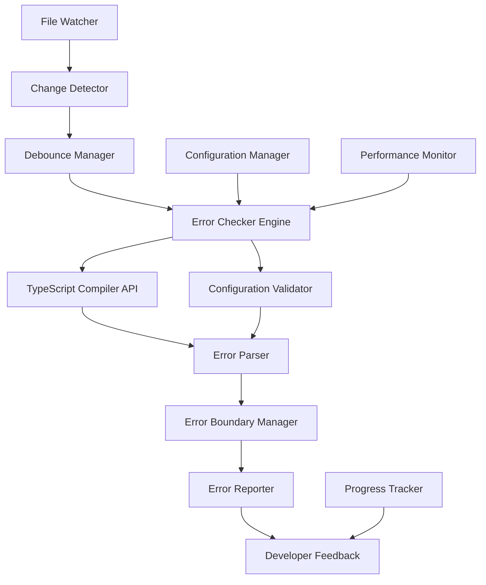

# Design Document

## Overview

The Automated Error Checking System is a comprehensive solution that monitors TypeScript files and configuration changes, automatically running compilation checks and integrating with the existing error handling infrastructure. The system uses file watchers, incremental compilation, and intelligent debouncing to provide real-time feedback without impacting development performance.

## Architecture

### Core Components



### System Flow

1. **File Monitoring**: File watcher detects changes in TypeScript files and configuration files
2. **Change Processing**: Debounce manager batches rapid changes to optimize performance
3. **Error Checking**: Error checker engine runs appropriate validation based on file types
4. **Error Integration**: Results are integrated with the existing ErrorBoundaryManager
5. **Feedback Delivery**: Developers receive immediate feedback through multiple channels

## Components and Interfaces

### AutomatedErrorChecker

```typescript
interface AutomatedErrorChecker {
  // Core functionality
  startWatching(patterns: string[]): Promise<void>;
  stopWatching(): Promise<void>;
  checkFiles(files: string[]): Promise<ErrorCheckResult>;
  checkProject(): Promise<ErrorCheckResult>;

  // Configuration
  configure(config: ErrorCheckerConfig): void;
  getConfiguration(): ErrorCheckerConfig;

  // Integration
  setErrorBoundaryManager(manager: ErrorBoundaryManager): void;
  setPerformanceMonitor(monitor: PerformanceMonitor): void;

  // Events
  onErrorsDetected(callback: (result: ErrorCheckResult) => void): void;
  onErrorsResolved(callback: (files: string[]) => void): void;
  onProgress(callback: (progress: CheckProgress) => void): void;
}
```

### ErrorCheckerConfig

```typescript
interface ErrorCheckerConfig {
  // File patterns
  includePatterns: string[];
  excludePatterns: string[];

  // TypeScript options
  tsConfigPath: string;
  strictMode: boolean;
  enabledChecks: TypeScriptCheck[];

  // Performance settings
  debounceMs: number;
  maxConcurrentChecks: number;
  incrementalMode: boolean;

  // Integration settings
  integrateWithErrorBoundary: boolean;
  trackPerformanceMetrics: boolean;
  enableProgressReporting: boolean;

  // Output settings
  outputFormat: "human" | "json" | "junit";
  verboseLogging: boolean;
}
```

### ErrorCheckResult

```typescript
interface ErrorCheckResult {
  success: boolean;
  timestamp: number;
  duration: number;

  // Error details
  errors: CompilationError[];
  warnings: CompilationWarning[];

  // File information
  checkedFiles: string[];
  modifiedFiles: string[];

  // Statistics
  totalErrors: number;
  totalWarnings: number;
  errorsByFile: Record<string, number>;

  // Performance data
  compilationTime: number;
  memoryUsage: number;
}
```

### CompilationError

```typescript
interface CompilationError {
  id: string;
  file: string;
  line: number;
  column: number;
  message: string;
  code: number;
  category: "error" | "warning" | "suggestion";
  severity: ErrorSeverity;

  // Context
  source: string;
  relatedInformation?: DiagnosticRelatedInformation[];

  // Recovery
  fixable: boolean;
  suggestedFixes?: CodeFix[];
}
```

## Data Models

### File Watcher State

```typescript
interface WatcherState {
  isActive: boolean;
  watchedPatterns: string[];
  excludedPatterns: string[];
  lastChangeTime: number;
  pendingChanges: FileChange[];
  debounceTimer?: NodeJS.Timeout;
}

interface FileChange {
  path: string;
  type: "created" | "modified" | "deleted";
  timestamp: number;
  size?: number;
}
```

### Compilation Cache

```typescript
interface CompilationCache {
  // Incremental compilation data
  program?: ts.Program;
  sourceFiles: Map<string, ts.SourceFile>;
  lastBuildInfo?: ts.BuildInfo;

  // Performance tracking
  lastCompilationTime: number;
  averageCompilationTime: number;
  cacheHitRate: number;

  // Validation
  isValid: boolean;
  invalidationReasons: string[];
}
```

## Error Handling

### Error Categories

1. **Compilation Errors**: TypeScript syntax and type errors
2. **Configuration Errors**: Invalid tsconfig.json or other config files
3. **System Errors**: File system access, memory issues, etc.
4. **Performance Errors**: Timeouts, resource exhaustion

### Error Recovery Strategies

```typescript
interface ErrorRecoveryStrategy {
  // Automatic recovery
  retryCompilation(): Promise<boolean>;
  clearCache(): Promise<void>;
  resetWatcher(): Promise<void>;

  // Manual recovery options
  getRecoveryOptions(error: CompilationError): RecoveryOption[];
  applyQuickFix(error: CompilationError, fix: CodeFix): Promise<boolean>;

  // Fallback strategies
  enableFallbackMode(): void;
  disableStrictChecks(): void;
  skipProblematicFiles(files: string[]): void;
}
```

### Integration with ErrorBoundaryManager

The system will create ErrorLog entries for compilation errors:

```typescript
// Example error log creation
const errorLog: ErrorLog = {
  id: generateId(),
  message: compilationError.message,
  level: "error",
  component: "TypeScriptCompiler",
  action: "compile_file",
  timestamp: Date.now(),
  metadata: {
    file: compilationError.file,
    line: compilationError.line,
    column: compilationError.column,
    code: compilationError.code,
    tsVersion: ts.version,
  },
  errorType: ErrorType.VALIDATION_ERROR,
  severity: mapTsSeverityToErrorSeverity(compilationError.category),
  resolved: false,
};
```

## Testing Strategy

### Unit Tests

1. **File Watcher Tests**: Mock file system changes and verify detection
2. **Debounce Manager Tests**: Test batching and timing of change events
3. **Compiler Integration Tests**: Test TypeScript API integration
4. **Error Parser Tests**: Verify error message parsing and categorization
5. **Configuration Tests**: Test various configuration scenarios

### Integration Tests

1. **End-to-End Workflow**: File change → error detection → reporting
2. **Performance Tests**: Large codebase compilation performance
3. **Error Recovery Tests**: System behavior during various error conditions
4. **Cache Validation Tests**: Incremental compilation correctness

### Performance Tests

1. **Scalability Tests**: Performance with different project sizes
2. **Memory Usage Tests**: Memory consumption during long-running operations
3. **Debounce Effectiveness**: Optimization of rapid file changes
4. **Cache Efficiency**: Incremental compilation benefits

## Implementation Phases

### Phase 1: Core Infrastructure

- File watcher implementation
- Basic TypeScript compilation integration
- Error parsing and categorization
- Configuration management

### Phase 2: Performance Optimization

- Incremental compilation support
- Debounce management
- Caching strategies
- Progress reporting

### Phase 3: Error Integration

- ErrorBoundaryManager integration
- Error recovery strategies
- Performance metrics tracking
- Advanced error analysis

### Phase 4: Developer Experience

- Multiple output formats
- IDE integration hooks
- Pre-commit hook integration
- Advanced configuration options

## Security Considerations

1. **File System Access**: Validate file paths to prevent directory traversal
2. **Configuration Validation**: Sanitize and validate all configuration inputs
3. **Resource Limits**: Implement limits to prevent resource exhaustion attacks
4. **Error Information**: Sanitize error messages to prevent information disclosure

## Performance Considerations

1. **Incremental Compilation**: Use TypeScript's incremental compilation API
2. **File Watching Optimization**: Use efficient file watching strategies
3. **Memory Management**: Implement proper cleanup and garbage collection
4. **Debouncing**: Intelligent batching of file changes
5. **Parallel Processing**: Concurrent checking of independent files

## Monitoring and Metrics

The system will track:

- Compilation times and success rates
- Error detection and resolution rates
- File watching performance
- Cache hit rates and effectiveness
- Developer productivity impact

Integration with PerformanceMonitor:

```typescript
// Example metrics tracking
performanceMonitor.trackMetric("compilation_time", duration, {
  files_count: checkedFiles.length,
  errors_found: errors.length,
  cache_hit: cacheUsed ? "true" : "false",
});
```
