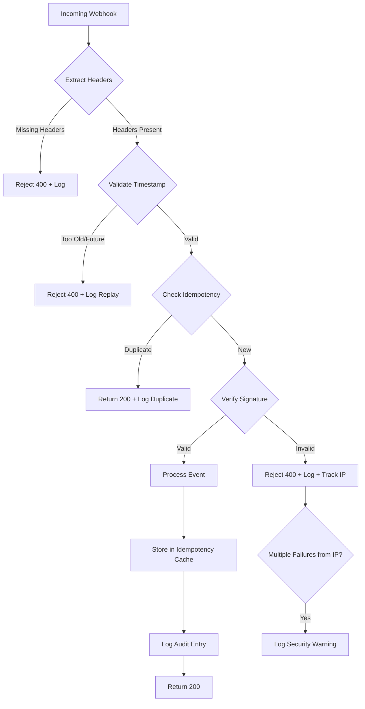

# Design Document: Clerk Webhook Security Enhancement

## Overview

This design enhances the security and observability of the Clerk Billing webhook endpoint by adding:

- Timestamp validation for replay attack protection
- Idempotency cache to prevent duplicate processing
- Structured audit logging for security analysis
- Suspicious activity detection and alerting

The implementation maintains full backward compatibility with the existing webhook handler while adding these security layers.

## Architecture



## Components and Interfaces

### 1. WebhookSecurityService

New service class to encapsulate security logic:

```typescript
interface WebhookSecurityConfig {
  maxTimestampAge: number; // Default: 300 seconds (5 minutes)
  maxTimestampFuture: number; // Default: 60 seconds
  idempotencyCacheSize: number; // Default: 10000 entries
  idempotencyCacheTTL: number; // Default: 300000 ms (5 minutes)
  failureTrackingWindow: number; // Default: 300000 ms (5 minutes)
  failureThreshold: number; // Default: 5 failures
}

interface WebhookSecurityService {
  validateTimestamp(timestamp: string): ValidationResult;
  checkIdempotency(svixId: string): IdempotencyResult;
  recordProcessed(svixId: string): void;
  trackSignatureFailure(ip: string): void;
  shouldWarnAboutIP(ip: string): boolean;
}
```

### 2. WebhookAuditLogger

Structured logging for webhook events:

```typescript
interface WebhookAuditEntry {
  requestId: string;
  timestamp: string;
  eventType: string;
  sourceIp: string;
  svixId: string;
  signatureValid: boolean;
  processingTimeMs: number;
  outcome: "success" | "rejected" | "duplicate" | "error";
  rejectionReason?: string;
  mutationCalled?: string;
  syncStatus?: boolean;
}

interface WebhookAuditLogger {
  log(entry: WebhookAuditEntry): void;
  logSecurityWarning(ip: string, failureCount: number): void;
}
```

### 3. LRUCache

Simple LRU cache for idempotency:

```typescript
interface LRUCache<K, V> {
  get(key: K): V | undefined;
  set(key: K, value: V): void;
  has(key: K): boolean;
  size: number;
}
```

## Data Models

### IdempotencyEntry

```typescript
interface IdempotencyEntry {
  svixId: string;
  processedAt: number; // Unix timestamp
  eventType: string;
}
```

### IPFailureRecord

```typescript
interface IPFailureRecord {
  ip: string;
  failures: number[]; // Array of failure timestamps
}
```

### ValidationResult

```typescript
type ValidationResult = { valid: true } | { valid: false; reason: string; code: string };
```

### IdempotencyResult

```typescript
type IdempotencyResult =
  | { isDuplicate: false }
  | { isDuplicate: true; originalProcessedAt: number };
```

## Correctness Properties

_A property is a characteristic or behavior that should hold true across all valid executions of a system-essentially, a formal statement about what the system should do. Properties serve as the bridge between human-readable specifications and machine-verifiable correctness guarantees._

### Property 1: Timestamp validation rejects out-of-window requests

_For any_ webhook request with a timestamp, if the timestamp is older than 300 seconds or more than 60 seconds in the future, the handler should reject the request with HTTP 400 and include "replay" or "invalid timestamp" in the rejection reason.

**Validates: Requirements 2.1, 2.2, 2.3**

### Property 2: Idempotency prevents duplicate processing

_For any_ webhook with a given svix-id, if that svix-id has been processed within the last 5 minutes, the handler should return HTTP 200 without calling any Convex mutations and log the duplicate detection.

**Validates: Requirements 3.1, 3.2**

### Property 3: LRU cache eviction maintains bounded memory

_For any_ sequence of webhook processing, the idempotency cache size should never exceed the configured maximum, and when full, the oldest entries should be evicted first.

**Validates: Requirements 3.3**

### Property 4: Audit logs contain all required fields

_For any_ webhook request (successful, rejected, or duplicate), the audit log entry should contain all required fields: requestId, timestamp, eventType, sourceIp, svixId, signatureValid, processingTimeMs, and outcome.

**Validates: Requirements 4.1, 4.2, 4.3**

### Property 5: Response format backward compatibility

_For any_ webhook request, the response JSON should contain at minimum: `received`, `synced`, and `requestId` fields, matching the existing WebhookResponse interface.

**Validates: Requirements 5.1, 5.2, 5.3**

## Error Handling

### Error Categories

| Error Type           | HTTP Status | Code                     | Recovery                    |
| -------------------- | ----------- | ------------------------ | --------------------------- |
| Missing Svix headers | 400         | WEBHOOK_MISSING_HEADERS  | None - reject               |
| Invalid timestamp    | 400         | WEBHOOK_REPLAY_DETECTED  | None - reject               |
| Duplicate webhook    | 200         | N/A                      | Return success (idempotent) |
| Invalid signature    | 400         | STRIPE_INVALID_SIGNATURE | None - reject               |
| Processing error     | 500         | WEBHOOK_PROCESSING_ERROR | Retry by Clerk              |

### Error Response Format

```typescript
{
  error: string;
  code: string;
  message: string;
  requestId: string;
  details?: Record<string, unknown>;
}
```

## Testing Strategy

### Dual Testing Approach

This implementation uses both unit tests and property-based tests:

- **Unit tests**: Verify specific examples, edge cases, and integration points
- **Property-based tests**: Verify universal properties hold across all valid inputs

### Property-Based Testing

**Library**: fast-check (already available in project dependencies)

**Configuration**: Minimum 100 iterations per property test

**Test Annotations**: Each property test will be tagged with:

```typescript
// **Feature: clerk-webhook-security, Property {number}: {property_text}**
```

### Unit Test Coverage

1. **Timestamp Validation**
   - Exact boundary tests (300s, 301s, 60s future, 61s future)
   - Current timestamp acceptance
   - Invalid timestamp format handling

2. **Idempotency Cache**
   - First request processing
   - Duplicate detection
   - TTL expiration
   - LRU eviction order

3. **Audit Logging**
   - All field presence verification
   - Rejection reason inclusion
   - Processing time accuracy

4. **Integration Tests**
   - Full webhook flow with mocked Svix
   - Backward compatibility verification

### Test File Structure

```
__tests__/
  webhook-security/
    timestamp-validation.test.ts
    idempotency-cache.test.ts
    audit-logging.test.ts
    webhook-security.property.test.ts  # Property-based tests
```
