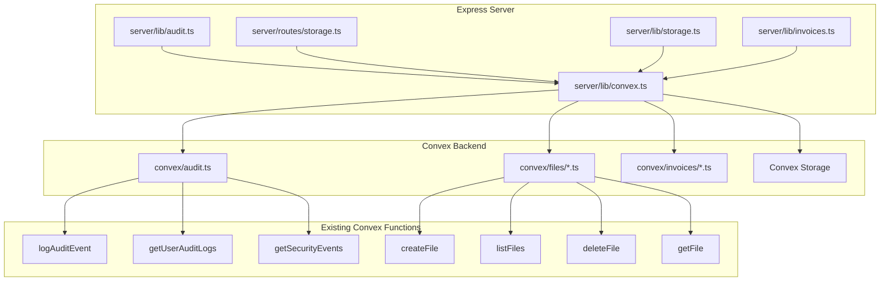

# Design Document: Convex Integration for Pending Files

## Overview

This design document describes the integration of four server-side files with Convex database. The files currently use placeholder implementations (console.log, empty arrays, placeholder URLs) and need to be connected to existing Convex functions and storage.

The integration follows the established pattern in the codebase: Express routes call Convex functions via `ConvexHttpClient` using lazy initialization from `server/lib/convex.ts`.

## Architecture



## Components and Interfaces

### 1. AuditLogger Integration (`server/lib/audit.ts`)

**Current State:** Logs to console, returns empty arrays for queries.

**Target State:** Calls Convex mutations/queries for all operations.

```typescript
// Updated interface - no changes needed, implementation changes only
export interface AuditLogEntry {
  userId?: string;
  action: string;
  resource: string;
  details?: Record<string, unknown>;
  ipAddress?: string;
  userAgent?: string;
}

// New internal method for Convex calls
private async callConvexAudit(
  functionName: string,
  args: Record<string, unknown>
): Promise<unknown>;
```

**Integration Pattern:**

- Use `getConvex()` for lazy client initialization
- Call `api.audit.logAuditEvent` for logging
- Call `api.audit.getUserAuditLogs` for user logs
- Call `api.audit.getSecurityEvents` for security events
- Wrap all calls in try-catch for graceful degradation

### 2. Storage Routes Integration (`server/routes/storage.ts`)

**Current State:** Uses placeholder objects and returns empty arrays.

**Target State:** Calls Convex functions for file CRUD operations.

```typescript
// File record creation after upload
const fileId = await convex.mutation(api.files.createFile.createFile, {
  filename: fileName,
  originalName: req.file.originalname,
  storagePath: path,
  mimeType: req.file.mimetype,
  size: req.file.size,
  role: fileRole,
  reservationId: reservation_id || undefined,
  orderId: order_id || undefined,
});

// File listing with filters
const files = await convex.query(api.files.listFiles.listFiles, {
  role: roleFilter,
  reservationId: reservationIdFilter,
  orderId: orderIdFilter,
});
```

**Authentication Flow:**

1. Express validates Clerk session via `req.isAuthenticated()`
2. Extract `clerkId` from `req.user`
3. Pass `clerkId` to Convex functions that need user context
4. Convex functions resolve user internally via `by_clerk_id` index

### 3. Storage Library Integration (`server/lib/storage.ts`)

**Current State:** Returns placeholder URLs, no actual storage.

**Target State:** Uses Convex Storage for file operations.

**New Convex Action Required:**

```typescript
// convex/files/storage.ts - New file
export const uploadToStorage = action({
  args: {
    fileData: v.string(), // Base64 encoded
    filename: v.string(),
    mimeType: v.string(),
    bucket: v.string(),
  },
  handler: async (ctx, args): Promise<{ storageId: string; url: string }> => {
    const buffer = Buffer.from(args.fileData, "base64");
    const blob = new Blob([buffer], { type: args.mimeType });
    const storageId = await ctx.storage.store(blob);
    const url = await ctx.storage.getUrl(storageId);
    return { storageId: storageId as string, url: url || "" };
  },
});

export const getStorageUrl = action({
  args: {
    storageId: v.string(),
  },
  handler: async (ctx, args): Promise<string> => {
    const url = await ctx.storage.getUrl(args.storageId as Id<"_storage">);
    return url || "";
  },
});

export const deleteFromStorage = action({
  args: {
    storageId: v.string(),
  },
  handler: async (ctx, args): Promise<void> => {
    await ctx.storage.delete(args.storageId as Id<"_storage">);
  },
});
```

### 4. Invoice Integration (`server/lib/invoices.ts`)

**Current State:** Generates invoice numbers without persistence, placeholder PDF URLs.

**Target State:** Uses atomic counters and Convex Storage for PDFs.

**New Convex Mutation Required:**

```typescript
// convex/invoices/generateInvoiceNumber.ts - New file
export const generateInvoiceNumber = mutation({
  args: {
    orderId: v.id("orders"),
  },
  handler: async (ctx, args): Promise<string> => {
    // Check if order already has invoice number
    const order = await ctx.db.get(args.orderId);
    if (order?.invoiceNumber) {
      return order.invoiceNumber;
    }

    const year = new Date().getFullYear();
    const counterName = `invoice_${year}`;

    // Get or create counter
    let counter = await ctx.db
      .query("counters")
      .withIndex("by_name", q => q.eq("name", counterName))
      .first();

    let sequence: number;
    if (!counter) {
      sequence = 1;
      await ctx.db.insert("counters", { name: counterName, value: 1 });
    } else {
      sequence = counter.value + 1;
      await ctx.db.patch(counter._id, { value: sequence });
    }

    const invoiceNumber = `BRLB-${year}-${String(sequence).padStart(6, "0")}`;

    // Update order with invoice number
    await ctx.db.patch(args.orderId, { invoiceNumber });

    return invoiceNumber;
  },
});
```

## Data Models

### Existing Tables Used

**auditLogs** (no changes needed):

```typescript
{
  userId: v.optional(v.id("users")),
  clerkId: v.optional(v.string()),
  action: v.string(),
  resource: v.string(),
  details: v.optional(v.any()),
  ipAddress: v.optional(v.string()),
  userAgent: v.optional(v.string()),
  timestamp: v.number(),
}
```

**files** (no changes needed):

```typescript
{
  userId: v.id("users"),
  filename: v.string(),
  originalName: v.string(),
  storagePath: v.string(),
  mimeType: v.string(),
  size: v.number(),
  role: v.union(v.literal("upload"), v.literal("deliverable"), v.literal("invoice")),
  reservationId: v.optional(v.id("reservations")),
  orderId: v.optional(v.id("orders")),
  ownerId: v.id("users"),
  createdAt: v.number(),
}
```

**counters** (no changes needed):

```typescript
{
  name: v.string(),
  value: v.number(),
}
```

**invoicesOrders** (no changes needed):

```typescript
{
  orderId: v.id("orders"),
  number: v.string(),
  pdfKey: v.string(),
  pdfUrl: v.optional(v.string()),
  amount: v.number(),
  currency: v.string(),
  issuedAt: v.number(),
  // ... other fields
}
```

## Correctness Properties

_A property is a characteristic or behavior that should hold true across all valid executions of a system-essentially, a formal statement about what the system should do. Properties serve as the bridge between human-readable specifications and machine-verifiable correctness guarantees._

### Property 1: Audit Log Persistence

_For any_ audit log entry passed to AuditLogger.log(), the entry should be retrievable from Convex auditLogs table with matching action, resource, and details fields.
**Validates: Requirements 1.1**

### Property 2: Audit Log Ordering

_For any_ user with multiple audit logs, calling getUserAuditLogs should return logs in descending timestamp order (most recent first).
**Validates: Requirements 1.2**

### Property 3: Security Event Filtering

_For any_ set of audit logs, calling getSecurityEvents should return only logs where action is one of: "login_failed", "security_event", "rate_limit_exceeded".
**Validates: Requirements 1.3**

### Property 4: Audit Error Graceful Degradation

_For any_ Convex failure during audit logging, the AuditLogger should not throw an exception and should log the error to console.
**Validates: Requirements 1.4, 5.1**

### Property 5: File Upload Persistence

_For any_ successful file upload, a corresponding file record should exist in Convex with matching filename, size, mimeType, and role.
**Validates: Requirements 2.1**

### Property 6: File Ownership Enforcement

_For any_ file operation (signed URL, delete), if the requesting user does not own the file, the system should return a 403 error and not perform the operation.
**Validates: Requirements 2.2, 2.4, 2.5**

### Property 7: File Listing Completeness

_For any_ user, listing files should return all files owned by that user, and filtering by role should return only files matching that role.
**Validates: Requirements 2.3**

### Property 8: Storage Upload Round-Trip

_For any_ file buffer uploaded via uploadUserFile, the returned URL should allow retrieval of the same file content.
**Validates: Requirements 3.1**

### Property 9: Signed URL Validity

_For any_ file in storage, getSignedUrl should return a URL that provides access to the file content.
**Validates: Requirements 3.2**

### Property 10: Storage Deletion Completeness

_For any_ file deleted via deleteFile, subsequent attempts to access the file should fail.
**Validates: Requirements 3.3**

### Property 11: Invoice Number Uniqueness and Format

_For any_ set of orders, each generated invoice number should be unique and match the format BRLB-{YEAR}-{6-DIGIT-SEQUENCE}.
**Validates: Requirements 4.1, 4.2**

### Property 12: Invoice Number Idempotency

_For any_ order, calling ensureInvoiceNumber multiple times should return the same invoice number.
**Validates: Requirements 4.4**

### Property 13: Invoice PDF Persistence

_For any_ order with a generated PDF, the PDF URL should be stored in the invoicesOrders table and the PDF should be accessible.
**Validates: Requirements 4.3**

### Property 14: File Operation Error Responses

_For any_ Convex failure during file operations, the system should return an appropriate HTTP error response (4xx or 5xx) with a descriptive message.
**Validates: Requirements 5.2**

### Property 15: Invoice Error Strictness

_For any_ Convex failure during invoice generation, the system should throw an error to prevent incomplete invoice records.
**Validates: Requirements 5.3**

## Error Handling

### Audit Logger

- **Strategy:** Silent failure with console logging
- **Rationale:** Audit logging should never block business operations
- **Implementation:** Wrap all Convex calls in try-catch, log errors, return gracefully

### Storage Routes

- **Strategy:** HTTP error responses
- **Rationale:** Users need feedback when file operations fail
- **Implementation:** Use `handleRouteError()` helper, return appropriate status codes

### Storage Library

- **Strategy:** Throw descriptive errors
- **Rationale:** Callers need to handle storage failures explicitly
- **Implementation:** Throw errors with context (operation, file path, original error)

### Invoice Generation

- **Strategy:** Strict error propagation
- **Rationale:** Incomplete invoices cause business/legal issues
- **Implementation:** Let errors propagate, caller must handle

## Testing Strategy

### Unit Testing

- Mock `getConvex()` to return a mock client
- Test each function in isolation
- Verify correct Convex function calls with expected arguments
- Test error handling paths

### Property-Based Testing

- Use **fast-check** library for property-based tests
- Generate random audit entries, file metadata, and order IDs
- Verify properties hold across all generated inputs
- Configure minimum 100 iterations per property test

**Test File Locations:**

- `__tests__/server/lib/audit.test.ts`
- `__tests__/server/routes/storage.test.ts`
- `__tests__/server/lib/storage.test.ts`
- `__tests__/server/lib/invoices.test.ts`

**Property Test Annotations:**
Each property-based test must include a comment in this format:

```typescript
// **Feature: convex-integration-pending, Property 1: Audit Log Persistence**
```
