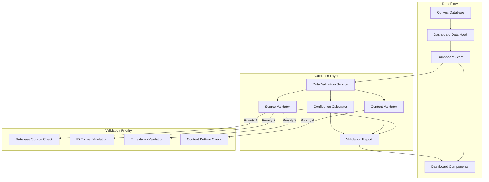

# Design Document

## Overview

This design document outlines the solution for fixing false positive mock data detection in the BroLab Entertainment dashboard. The current `DataValidationService` uses overly aggressive pattern matching that flags legitimate user data as mock/placeholder data. The solution involves refining detection patterns, implementing source-based validation priority, adjusting confidence thresholds, and adding context-aware validation logic.

## Architecture

### High-Level Architecture



### Validation Flow

The new validation system implements a priority-based approach:

1. **Source Validation (Highest Priority)**: Check if data comes from authenticated Convex database
2. **ID Validation**: Verify Convex document IDs and relational IDs
3. **Timestamp Validation**: Check for valid Convex timestamps
4. **Content Validation (Lowest Priority)**: Pattern matching only if source validation is inconclusive

## Components and Interfaces

### Core Components

#### 1. Enhanced Data Source Validator

```typescript
interface SourceValidationConfig {
  /** Whether to trust authenticated database sources */
  trustDatabaseSource: boolean;
  /** Whether to validate Convex document IDs */
  validateConvexIds: boolean;
  /** Whether to check timestamp authenticity */
  validateTimestamps: boolean;
  /** Minimum confidence required to flag as mock */
  minConfidenceThreshold: number;
  /** Whether to use strict pattern matching */
  useStrictPatterns: boolean;
}

interface ConvexIdValidation {
  /** Whether ID matches Convex format */
  isValidFormat: boolean;
  /** ID pattern (e.g., "jx7..." for Convex) */
  pattern: string;
  /** Confidence that this is a real Convex ID */
  confidence: number;
}

interface SourceValidator {
  /** Validate data source authenticity */
  validateSource: (data: DashboardData) => SourceValidationResult;

  /** Check if data comes from Convex */
  isConvexData: (data: unknown) => boolean;

  /** Validate Convex document ID format */
  validateConvexId: (id: string) => ConvexIdValidation;

  /** Check timestamp authenticity */
  validateTimestamp: (timestamp: number | string) => boolean;

  /** Calculate source confidence score */
  calculateSourceConfidence: (data: DashboardData) => number;
}

interface SourceValidationResult {
  /** Data source type */
  source: "convex" | "database" | "cache" | "unknown";
  /** Whether source is authenticated */
  isAuthenticated: boolean;
  /** Source confidence score (0-1) */
  confidence: number;
  /** Validation details */
  details: {
    hasValidIds: boolean;
    hasValidTimestamps: boolean;
    idValidations: ConvexIdValidation[];
    timestampCount: number;
  };
}
```

#### 2. Refined Content Validator

```typescript
interface ContentValidationConfig {
  /** Strict placeholder text patterns (exact matches only) */
  strictPlaceholderPatterns: string[];
  /** Test email domains to flag */
  testEmailDomains: string[];
  /** Whether to flag common names */
  flagCommonNames: boolean;
  /** Whether to flag zero values */
  flagZeroValues: boolean;
  /** Whether to flag round numbers */
  flagRoundNumbers: boolean;
  /** Minimum pattern matches required */
  minPatternMatches: number;
}

interface ContentValidator {
  /** Validate content for mock data patterns */
  validateContent: (data: DashboardData, sourceConfidence: number) => ContentValidationResult;

  /** Check for strict placeholder text */
  checkStrictPlaceholders: (text: string) => MockDataIndicator | null;

  /** Validate email authenticity */
  validateEmail: (email: string) => MockDataIndicator | null;

  /** Check if name is placeholder */
  validateName: (name: string) => MockDataIndicator | null;

  /** Validate numeric values */
  validateNumber: (value: number, context: string) => MockDataIndicator | null;
}

interface ContentValidationResult {
  /** Mock indicators found */
  indicators: MockDataIndicator[];
  /** Overall content confidence (0-1) */
  confidence: number;
  /** Whether content appears real */
  appearsReal: boolean;
}
```

#### 3. Confidence Calculator

```typescript
interface ConfidenceWeights {
  /** Weight for source validation */
  sourceWeight: number;
  /** Weight for ID validation */
  idWeight: number;
  /** Weight for timestamp validation */
  timestampWeight: number;
  /** Weight for content validation */
  contentWeight: number;
}

interface ConfidenceCalculator {
  /** Calculate overall confidence that data is real */
  calculateOverallConfidence: (
    sourceResult: SourceValidationResult,
    contentResult: ContentValidationResult
  ) => ConfidenceScore;

  /** Determine if data should be flagged as mock */
  shouldFlagAsMock: (confidence: ConfidenceScore) => boolean;

  /** Get confidence breakdown for debugging */
  getConfidenceBreakdown: (confidence: ConfidenceScore) => ConfidenceBreakdown;
}

interface ConfidenceScore {
  /** Overall confidence (0-1) */
  overall: number;
  /** Source confidence component */
  source: number;
  /** Content confidence component */
  content: number;
  /** Combined weighted score */
  weighted: number;
  /** Whether data should be flagged */
  shouldFlag: boolean;
}

interface ConfidenceBreakdown {
  /** Individual component scores */
  components: {
    source: { score: number; weight: number; contribution: number };
    ids: { score: number; weight: number; contribution: number };
    timestamps: { score: number; weight: number; contribution: number };
    content: { score: number; weight: number; contribution: number };
  };
  /** Factors that increased confidence */
  positiveFactors: string[];
  /** Factors that decreased confidence */
  negativeFactors: string[];
  /** Final decision reasoning */
  reasoning: string;
}
```

### Enhanced Mock Data Indicator

```typescript
interface EnhancedMockDataIndicator extends MockDataIndicator {
  /** Indicator strength */
  strength: "weak" | "moderate" | "strong" | "definitive";
  /** Whether this indicator alone should flag data */
  isDefinitive: boolean;
  /** Context in which indicator was found */
  context: string;
  /** Suggested action */
  suggestedAction: "ignore" | "investigate" | "flag" | "block";
}
```

## Data Models

### Validation Configuration

```typescript
interface ValidationConfiguration {
  /** Environment-specific settings */
  environment: "development" | "staging" | "production";

  /** Source validation config */
  sourceValidation: SourceValidationConfig;

  /** Content validation config */
  contentValidation: ContentValidationConfig;

  /** Confidence calculation config */
  confidenceCalculation: {
    weights: ConfidenceWeights;
    thresholds: {
      /** Minimum confidence to consider data real */
      realDataThreshold: number;
      /** Maximum confidence to flag as mock */
      mockDataThreshold: number;
      /** Threshold for uncertain data */
      uncertaintyThreshold: number;
    };
  };

  /** Behavior settings */
  behavior: {
    /** Whether to show warnings in production */
    showProductionWarnings: boolean;
    /** Whether to log validation details */
    enableDetailedLogging: boolean;
    /** Whether to fail silently on errors */
    failSilently: boolean;
    /** Whether to trust authenticated sources */
    trustAuthenticatedSources: boolean;
  };
}
```

### Refined Pattern Definitions

```typescript
interface RefinedPatterns {
  /** Strict placeholder text (exact matches only) */
  strictPlaceholders: {
    /** Exact text matches */
    exact: string[];
    /** Case-sensitive regex with word boundaries */
    regex: RegExp[];
  };

  /** Test email patterns */
  testEmails: {
    /** Test domains to flag */
    domains: string[];
    /** Email patterns to flag */
    patterns: RegExp[];
  };

  /** Excluded common values (NOT mock data) */
  excludedValues: {
    /** Common legitimate names */
    names: string[];
    /** Common legitimate numbers */
    numbers: number[];
    /** Common legitimate text */
    text: string[];
  };
}
```

## Error Handling

### Validation Error Handling

```typescript
interface ValidationErrorHandler {
  /** Handle validation errors gracefully */
  handleValidationError: (error: Error, context: ValidationContext) => ValidationErrorResult;

  /** Determine if error should be shown to user */
  shouldShowError: (error: Error, environment: string) => boolean;

  /** Get fallback validation result */
  getFallbackResult: (data: DashboardData) => DataSourceValidation;
}

interface ValidationErrorResult {
  /** Whether validation succeeded despite error */
  success: boolean;
  /** Fallback validation result */
  result: DataSourceValidation;
  /** Error details for logging */
  errorDetails: {
    message: string;
    stack?: string;
    context: ValidationContext;
  };
  /** Whether to retry validation */
  shouldRetry: boolean;
}

interface ValidationContext {
  /** Component triggering validation */
  component: string;
  /** User ID if available */
  userId?: string;
  /** Data being validated */
  dataSnapshot: Partial<DashboardData>;
  /** Validation attempt number */
  attemptNumber: number;
}
```

## Testing Strategy

### Unit Testing

```typescript
describe("Enhanced Data Validation", () => {
  describe("Source Validation", () => {
    it("should recognize Convex data as real");
    it("should validate Convex document ID format");
    it("should validate Convex timestamps");
    it("should calculate high source confidence for database data");
    it("should not flag data with valid IDs as mock");
  });

  describe("Content Validation", () => {
    it("should use strict placeholder matching");
    it("should not flag common names as mock");
    it("should not flag zero values as suspicious");
    it("should not flag legitimate email addresses");
    it("should require multiple strong indicators to flag");
  });

  describe("Confidence Calculation", () => {
    it("should prioritize source confidence over content");
    it("should require high confidence to flag as mock");
    it("should combine indicators appropriately");
    it("should provide detailed confidence breakdown");
  });

  describe("False Positive Prevention", () => {
    it("should not flag new user with empty data");
    it("should not flag user with common name");
    it("should not flag legitimate zero statistics");
    it("should not flag data from authenticated source");
    it("should achieve <1% false positive rate");
  });
});
```

### Integration Testing

```typescript
describe("End-to-End Validation", () => {
  describe("Real User Data", () => {
    it("should validate real Convex data without warnings");
    it("should handle new users with empty data");
    it("should handle users with common names");
    it("should handle legitimate zero values");
  });

  describe("Actual Mock Data", () => {
    it("should detect obvious placeholder text");
    it("should detect test email addresses");
    it("should detect hardcoded test data");
    it("should flag data without valid IDs");
  });

  describe("Edge Cases", () => {
    it("should handle partial data gracefully");
    it("should handle validation errors without crashing");
    it("should handle missing timestamps");
    it("should handle unusual but legitimate data");
  });
});
```

## Performance Optimizations

### Validation Performance

1. **Early Exit Strategy**:
   - If source validation confirms database origin, skip content validation
   - If valid Convex IDs found, mark as real immediately
   - Cache validation results for 30 seconds

2. **Lazy Evaluation**:
   - Only run expensive pattern matching if source validation is inconclusive
   - Skip content validation for authenticated database sources
   - Defer detailed logging until needed

3. **Optimized Pattern Matching**:
   - Use exact string matches before regex
   - Limit regex complexity
   - Use Set lookups for excluded values

## Implementation Details

### Convex ID Validation

```typescript
/**
 * Validate Convex document ID format
 * Convex IDs typically start with specific prefixes and have consistent length
 */
function validateConvexId(id: string): ConvexIdValidation {
  // Convex IDs are base64-like strings with specific patterns
  const convexIdPattern = /^[a-z0-9]{16,32}$/i;

  const isValidFormat = convexIdPattern.test(id);

  return {
    isValidFormat,
    pattern: isValidFormat ? "convex" : "unknown",
    confidence: isValidFormat ? 0.95 : 0.0,
  };
}
```

### Strict Placeholder Detection

```typescript
/**
 * Check for strict placeholder text using exact matches
 */
function checkStrictPlaceholders(text: string): MockDataIndicator | null {
  const strictPlaceholders = ["Lorem ipsum", "PLACEHOLDER", "TODO", "TBD", "FIXME", "XXX"];

  // Exact match only (case-insensitive)
  const lowerText = text.toLowerCase();
  for (const placeholder of strictPlaceholders) {
    if (lowerText === placeholder.toLowerCase()) {
      return {
        field: "text",
        type: "placeholder_text",
        value: text,
        confidence: 0.99,
        reason: `Exact match for placeholder text: "${placeholder}"`,
      };
    }
  }

  return null;
}
```

### Source-Priority Validation

```typescript
/**
 * Validate data with source priority
 */
async function validateWithSourcePriority(data: DashboardData): Promise<DataSourceValidation> {
  // Step 1: Validate source
  const sourceResult = await validateSource(data);

  // If source is authenticated database, trust it
  if (sourceResult.isAuthenticated && sourceResult.confidence > 0.9) {
    return {
      isRealData: true,
      hasMockData: false,
      isFresh: true,
      dataAge: calculateDataAge(data),
      source: "database",
      validatedAt: Date.now(),
      mockIndicators: [],
      freshnessWarnings: [],
    };
  }

  // Step 2: Validate IDs
  const idValidation = validateIds(data);
  if (idValidation.hasValidIds && idValidation.confidence > 0.9) {
    return {
      isRealData: true,
      hasMockData: false,
      isFresh: true,
      dataAge: calculateDataAge(data),
      source: "database",
      validatedAt: Date.now(),
      mockIndicators: [],
      freshnessWarnings: [],
    };
  }

  // Step 3: Content validation (only if source is uncertain)
  const contentResult = await validateContent(data, sourceResult.confidence);

  // Combine results with source priority
  return combineValidationResults(sourceResult, idValidation, contentResult);
}
```

## Migration Strategy

### Phase 1: Update Validation Patterns (Week 1)

1. **Refine Pattern Definitions**:
   - Update `mockDataPatterns` in `DataValidationService`
   - Remove overly broad patterns
   - Add excluded common values
   - Implement strict matching

2. **Add Source Validation**:
   - Implement Convex ID validation
   - Add timestamp validation
   - Create source confidence calculator

### Phase 2: Implement Priority System (Week 1-2)

1. **Source-Priority Logic**:
   - Implement source validation priority
   - Add early exit for authenticated sources
   - Update confidence calculation

2. **Confidence Thresholds**:
   - Adjust thresholds for production
   - Implement environment-specific settings
   - Add confidence breakdown logging

### Phase 3: Testing and Validation (Week 2)

1. **Comprehensive Testing**:
   - Test with real user data
   - Verify false positive rate < 1%
   - Test edge cases

2. **Production Safeguards**:
   - Add production-specific settings
   - Implement silent failure mode
   - Add detailed logging

### Phase 4: Deployment and Monitoring (Week 2-3)

1. **Gradual Rollout**:
   - Deploy to development first
   - Monitor validation results
   - Adjust thresholds as needed

2. **Production Deployment**:
   - Deploy with conservative settings
   - Monitor for false positives
   - Collect user feedback

## Monitoring and Analytics

### Validation Metrics

```typescript
interface ValidationMetrics {
  /** Total validations performed */
  totalValidations: number;
  /** Validations flagged as mock */
  mockDataDetections: number;
  /** False positive rate */
  falsePositiveRate: number;
  /** Average confidence scores */
  averageConfidence: {
    source: number;
    content: number;
    overall: number;
  };
  /** Validation performance */
  performance: {
    averageDuration: number;
    cacheHitRate: number;
  };
}
```

### Monitoring Dashboard

Track key metrics:

- False positive rate (target: < 1%)
- Validation duration (target: < 50ms)
- Cache hit rate (target: > 80%)
- Mock data detection rate
- User-reported issues

This design provides a comprehensive solution to eliminate false positive mock data detection while maintaining the ability to detect actual mock/placeholder data when present.
