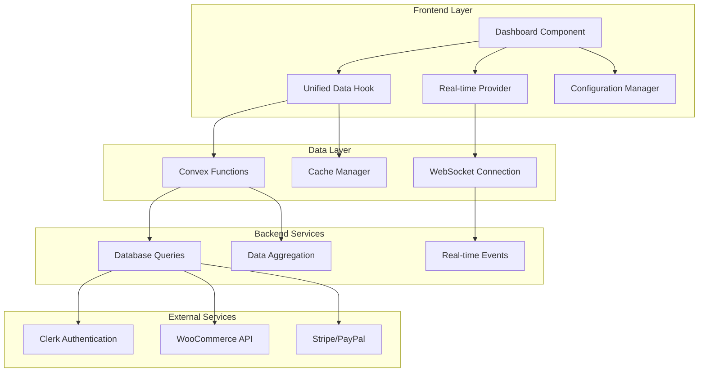

# Design Document

## Overview

This design document outlines the architecture for modernizing the BroLab Entertainment user dashboard. The current implementation suffers from performance issues, type safety problems, and poor user experience due to excessive lazy loading, inconsistent data fetching, and hardcoded fallbacks. The new design focuses on creating a unified, performant, and maintainable dashboard system with real-time capabilities.

## Architecture

### High-Level Architecture



### Data Flow Architecture

The new architecture implements a unidirectional data flow with optimistic updates:

1. **Single Source of Truth**: Unified dashboard hook manages all data fetching
2. **Real-time Updates**: WebSocket connections for live data synchronization
3. **Optimistic Updates**: Immediate UI updates with rollback on failure
4. **Intelligent Caching**: Smart cache invalidation based on user actions

## Components and Interfaces

### Core Components

#### 1. Unified Dashboard Hook

```typescript
interface DashboardData {
  user: DashboardUser;
  stats: UserStats;
  favorites: Favorite[];
  orders: Order[];
  downloads: Download[];
  reservations: Reservation[];
  activity: Activity[];
  chartData: ChartDataPoint[];
  trends: TrendData;
}

interface DashboardHookReturn extends DashboardData {
  isLoading: boolean;
  error: Error | null;
  refetch: () => Promise<void>;
  optimisticUpdate: (update: Partial<DashboardData>) => void;
}

export function useDashboard(): DashboardHookReturn;
```

#### 2. Real-time Provider

```typescript
interface RealtimeContextValue {
  isConnected: boolean;
  connectionStatus: "connecting" | "connected" | "disconnected" | "error";
  subscribe: (event: string, callback: (data: any) => void) => () => void;
  emit: (event: string, data: any) => void;
}

export function DashboardRealtimeProvider({ children }: PropsWithChildren);
```

#### 3. Configuration Manager

```typescript
interface DashboardConfig {
  ui: {
    animationDuration: number;
    skeletonItems: number;
    maxActivityItems: number;
  };
  pagination: {
    ordersPerPage: number;
    downloadsPerPage: number;
    activityPerPage: number;
  };
  realtime: {
    reconnectInterval: number;
    maxRetries: number;
    heartbeatInterval: number;
  };
  features: {
    realtimeUpdates: boolean;
    analyticsCharts: boolean;
    advancedFilters: boolean;
  };
}

export const useDashboardConfig: () => DashboardConfig;
```

### Component Hierarchy

```
Dashboard
├── DashboardLayout
│   ├── DashboardHeader
│   ├── StatsOverview
│   │   └── StatCard[]
│   └── DashboardTabs
│       ├── OverviewTab
│       │   ├── ActivityFeed
│       │   └── RecommendationsPanel
│       ├── AnalyticsTab
│       │   └── TrendCharts
│       ├── OrdersTab
│       ├── DownloadsTab
│       ├── ReservationsTab
│       ├── ProfileTab
│       └── SettingsTab
└── ErrorBoundary
```

### Enhanced Loading States

```typescript
interface LoadingStateProps {
  variant: "skeleton" | "spinner" | "pulse";
  size?: "sm" | "md" | "lg";
  count?: number;
}

// Specialized loading components
export function DashboardSkeleton();
export function StatsCardsSkeleton();
export function ActivityFeedSkeleton();
export function ChartsSkeleton();
```

## Data Models

### Core Data Types

```typescript
interface DashboardUser {
  id: string;
  clerkId: string;
  email: string;
  firstName?: string;
  lastName?: string;
  imageUrl?: string;
  preferences: UserPreferences;
  subscription?: SubscriptionInfo;
}

interface UserStats {
  totalFavorites: number;
  totalDownloads: number;
  totalOrders: number;
  totalSpent: number; // Always in dollars
  recentActivity: number;
  quotaUsed: number;
  quotaLimit: number;
}

interface Activity {
  id: string;
  type: "favorite_added" | "download" | "order_placed" | "reservation_made";
  description: string;
  timestamp: string;
  metadata: Record<string, any>;
  beatId?: string;
  beatTitle?: string;
}

interface Favorite {
  id: string;
  beatId: string;
  beatTitle: string;
  beatArtist?: string;
  beatImageUrl?: string;
  createdAt: string;
}

interface Order {
  id: string;
  orderNumber: string;
  items: OrderItem[];
  total: number; // Always in dollars
  currency: string;
  status: OrderStatus;
  paymentMethod: string;
  createdAt: string;
  updatedAt: string;
}

interface Download {
  id: string;
  beatId: string;
  beatTitle: string;
  fileSize: number;
  format: "mp3" | "wav" | "flac";
  quality: string;
  licenseType: string;
  downloadedAt: string;
  downloadCount: number;
  maxDownloads?: number;
  downloadUrl: string;
}

interface Reservation {
  id: string;
  serviceType: "mixing" | "mastering" | "recording" | "consultation";
  preferredDate: string;
  duration: number; // in minutes
  totalPrice: number; // Always in dollars
  status: ReservationStatus;
  details: Record<string, any>;
  createdAt: string;
}
```

### Chart Data Models

```typescript
interface ChartDataPoint {
  date: string;
  orders: number;
  downloads: number;
  revenue: number; // Always in dollars
  favorites: number;
}

interface TrendData {
  orders: TrendMetric;
  downloads: TrendMetric;
  revenue: TrendMetric;
  favorites: TrendMetric;
}

interface TrendMetric {
  period: "7d" | "30d" | "90d" | "1y";
  value: number;
  change: number;
  changePercent: number;
  isPositive: boolean;
}
```

## Error Handling

### Error Types and Recovery Strategies

```typescript
enum DashboardErrorType {
  NETWORK_ERROR = "network_error",
  AUTH_ERROR = "auth_error",
  DATA_ERROR = "data_error",
  REALTIME_ERROR = "realtime_error",
  VALIDATION_ERROR = "validation_error",
}

interface DashboardError {
  type: DashboardErrorType;
  message: string;
  code?: string;
  retryable: boolean;
  retryCount: number;
  maxRetries: number;
}

interface ErrorRecoveryStrategy {
  canRetry: (error: DashboardError) => boolean;
  getRetryDelay: (retryCount: number) => number;
  shouldFallback: (error: DashboardError) => boolean;
  getFallbackData: () => Partial<DashboardData>;
}
```

### Error Boundary Implementation

```typescript
interface ErrorBoundaryState {
  hasError: boolean;
  error: Error | null;
  errorInfo: ErrorInfo | null;
  retryCount: number;
}

export class DashboardErrorBoundary extends Component<
  PropsWithChildren<{ onError?: (error: Error) => void }>,
  ErrorBoundaryState
> {
  // Comprehensive error catching and recovery
}
```

## Testing Strategy

### Unit Testing

- **Component Testing**: React Testing Library for all dashboard components
- **Hook Testing**: Custom hook testing with mock data providers
- **Utility Testing**: Pure function testing for data transformations
- **Type Testing**: TypeScript compilation tests for type safety

### Integration Testing

- **Data Flow Testing**: End-to-end data fetching and state management
- **Real-time Testing**: WebSocket connection and event handling
- **Error Handling Testing**: Error boundary and recovery mechanisms
- **Performance Testing**: Component rendering and re-render optimization

### Test Structure

```typescript
describe("Dashboard", () => {
  describe("Data Loading", () => {
    it("should load dashboard data on mount");
    it("should handle loading states correctly");
    it("should display error states with retry options");
  });

  describe("Real-time Updates", () => {
    it("should update favorites in real-time");
    it("should handle connection failures gracefully");
    it("should implement optimistic updates");
  });

  describe("User Interactions", () => {
    it("should navigate between tabs correctly");
    it("should refresh data on user action");
    it("should handle pagination correctly");
  });
});
```

## Performance Optimizations

### Rendering Optimizations

1. **Memoization Strategy**:
   - `React.memo` for expensive components
   - `useMemo` for computed values
   - `useCallback` for event handlers

2. **Code Splitting**:
   - Route-level splitting for dashboard tabs
   - Component-level splitting for heavy features
   - Dynamic imports for optional features

3. **Virtual Scrolling**:
   - Large lists (orders, downloads, activity)
   - Windowing for performance
   - Intersection Observer for lazy loading

### Data Optimizations

1. **Query Optimization**:
   - Single optimized query with joins
   - Proper database indexing
   - Query result caching

2. **Real-time Efficiency**:
   - Selective subscriptions based on active tab
   - Debounced updates for rapid changes
   - Connection pooling and management

3. **Cache Strategy**:
   - Intelligent cache invalidation
   - Stale-while-revalidate pattern
   - Optimistic updates with rollback

## Security Considerations

### Data Protection

1. **Authentication**: Clerk-based authentication with JWT tokens
2. **Authorization**: Role-based access control for dashboard features
3. **Data Validation**: Zod schemas for all data inputs and outputs
4. **XSS Prevention**: Sanitized data rendering and CSP headers

### API Security

1. **Rate Limiting**: Per-user rate limits for API endpoints
2. **Input Validation**: Server-side validation for all requests
3. **Error Handling**: Secure error messages without data leakage
4. **Audit Logging**: Comprehensive logging for security events

## Internationalization

### Multi-language Support

```typescript
interface DashboardTranslations {
  stats: {
    favorites: string;
    downloads: string;
    orders: string;
    totalSpent: string;
  };
  tabs: {
    overview: string;
    analytics: string;
    orders: string;
    downloads: string;
    reservations: string;
    profile: string;
    settings: string;
  };
  errors: {
    network: string;
    authentication: string;
    generic: string;
    retry: string;
    refresh: string;
  };
}
```

### Currency Formatting

```typescript
interface CurrencyFormatter {
  format: (amount: number, currency?: string) => string;
  parse: (formatted: string) => number;
  convertFromCents: (cents: number) => number;
  getSymbol: (currency: string) => string;
}

export const useCurrencyFormatter: (currency?: string) => CurrencyFormatter;
```

## Migration Strategy

### Phase 1: Foundation (Week 1-2)

1. **Backend Optimization**:
   - Refactor Convex functions for optimized queries
   - Implement proper TypeScript types
   - Add database indexes for performance

2. **Data Layer Unification**:
   - Create unified dashboard hook
   - Implement proper error handling
   - Add comprehensive logging

### Phase 2: Frontend Modernization (Week 2-3)

1. **Component Restructure**:
   - Simplify component hierarchy
   - Remove unnecessary lazy loading
   - Implement consistent loading states

2. **State Management**:
   - Unified state management patterns
   - Optimistic update implementation
   - Cache management strategy

### Phase 3: Real-time Features (Week 3-4)

1. **WebSocket Integration**:
   - Real-time connection management
   - Event-based updates
   - Connection status indicators

2. **Performance Optimization**:
   - Component memoization
   - Query optimization
   - Bundle size reduction

### Phase 4: Configuration & Polish (Week 4-5)

1. **Configuration Management**:
   - Centralized configuration system
   - Environment-based feature flags
   - Performance tuning parameters

2. **User Experience Enhancement**:
   - Improved error handling
   - Better loading states
   - Accessibility improvements

## Monitoring and Analytics

### Performance Monitoring

```typescript
interface PerformanceMetrics {
  initialLoadTime: number;
  componentRenderTime: number;
  dataFetchTime: number;
  realtimeLatency: number;
  errorRate: number;
  userEngagement: number;
}

export const usePerformanceMonitoring: () => PerformanceMetrics;
```

### User Analytics

- Dashboard usage patterns
- Feature adoption rates
- Error frequency and types
- Performance bottlenecks
- User satisfaction metrics

This design provides a comprehensive foundation for modernizing the dashboard while maintaining backward compatibility and ensuring a smooth migration path.
