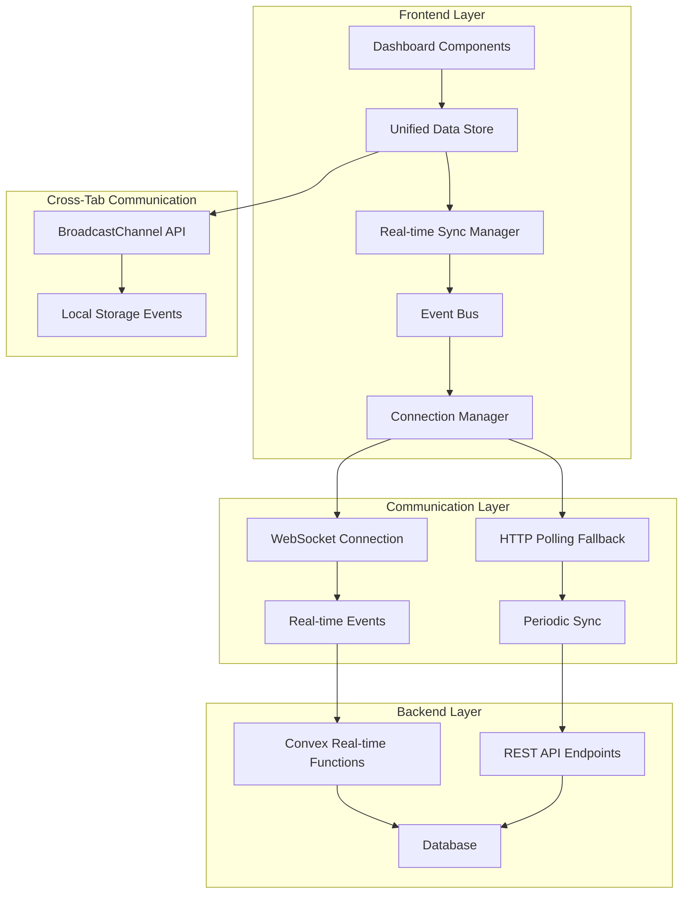

# Design Document

## Overview

Ce document de conception détaille l'architecture pour résoudre définitivement les problèmes de synchronisation des données en temps réel dans le dashboard utilisateur de BroLab Entertainment. La solution se concentre sur la création d'un système de synchronisation robuste qui garantit la cohérence des données entre toutes les sections du dashboard, avec des mécanismes de fallback et de récupération automatique.

## Architecture

### High-Level Architecture



### Data Flow Architecture

La nouvelle architecture implémente un flux de données unidirectionnel avec synchronisation en temps réel :

1. **Single Source of Truth**: Store unifié gérant toutes les données du dashboard
2. **Event-Driven Updates**: Système d'événements pour propager les changements
3. **Multi-Channel Communication**: WebSocket + HTTP + BroadcastChannel
4. **Automatic Conflict Resolution**: Résolution automatique des conflits de données

## Components and Interfaces

### Core Components

#### 1. Unified Data Store

```typescript
interface DashboardDataStore {
  // État des données
  data: DashboardData;
  lastUpdated: Record<string, number>;
  syncStatus: SyncStatus;

  // Actions
  updateData: (section: string, data: Partial<DashboardData>) => void;
  forceSync: () => Promise<void>;
  optimisticUpdate: (update: OptimisticUpdate) => void;
  rollbackUpdate: (updateId: string) => void;

  // Subscriptions
  subscribe: (section: string, callback: (data: DashboardData) => void) => () => void;
  subscribeToStatus: (callback: (status: SyncStatus) => void) => () => void;
}

interface DashboardData {
  user: DashboardUser;
  stats: ConsistentUserStats;
  favorites: Favorite[];
  orders: Order[];
  downloads: Download[];
  reservations: Reservation[];
  activity: Activity[];
  trends: TrendData;
  chartData: ChartDataPoint[];
}

interface ConsistentUserStats {
  totalFavorites: number;
  totalDownloads: number;
  totalOrders: number;
  totalSpent: number; // Toujours en dollars
  recentActivity: number;
  quotaUsed: number;
  quotaLimit: number;
  // Métadonnées pour la validation de cohérence
  calculatedAt: string;
  dataHash: string;
}
```

#### 2. Real-time Sync Manager

```typescript
interface SyncManager {
  // État de synchronisation
  isConnected: boolean;
  connectionType: "websocket" | "polling" | "offline";
  lastSyncTime: number;
  pendingUpdates: OptimisticUpdate[];

  // Méthodes de synchronisation
  startSync: () => Promise<void>;
  stopSync: () => void;
  forceSyncAll: () => Promise<void>;
  validateDataConsistency: () => Promise<boolean>;

  // Gestion des événements
  on: (event: SyncEvent, handler: (data: any) => void) => void;
  emit: (event: SyncEvent, data: any) => void;

  // Métriques et débogage
  getMetrics: () => SyncMetrics;
  enableDebugMode: (enabled: boolean) => void;
}

interface SyncStatus {
  connected: boolean;
  connectionType: "websocket" | "polling" | "offline";
  lastSync: number;
  syncInProgress: boolean;
  errors: SyncError[];
  metrics: SyncMetrics;
}

interface SyncMetrics {
  averageLatency: number;
  successRate: number;
  errorCount: number;
  reconnectCount: number;
  dataInconsistencies: number;
  lastInconsistencyTime?: number;
}
```

#### 3. Event Bus System

```typescript
interface EventBus {
  // Publication d'événements
  publish: <T>(event: DashboardEvent<T>) => void;

  // Souscription aux événements
  subscribe: <T>(
    eventType: string,
    handler: (event: DashboardEvent<T>) => void,
    options?: SubscriptionOptions
  ) => () => void;

  // Gestion des événements
  clear: () => void;
  getSubscribers: (eventType: string) => number;

  // Débogage
  enableLogging: (enabled: boolean) => void;
  getEventHistory: () => DashboardEvent<any>[];
}

interface DashboardEvent<T = any> {
  type: string;
  payload: T;
  timestamp: number;
  source: "user" | "server" | "system";
  id: string;
  correlationId?: string;
}

// Types d'événements spécifiques
type DashboardEventTypes = {
  "data.updated": { section: string; data: Partial<DashboardData> };
  "data.inconsistency": { sections: string[]; details: any };
  "connection.status": { status: SyncStatus };
  "optimistic.applied": { update: OptimisticUpdate };
  "optimistic.rollback": { updateId: string; reason: string };
  "sync.forced": { trigger: "user" | "system" | "error" };
  "error.sync": { error: SyncError; context: any };
};
```

#### 4. Connection Manager

```typescript
interface ConnectionManager {
  // État de connexion
  status: ConnectionStatus;
  currentConnection: Connection | null;

  // Gestion des connexions
  connect: () => Promise<void>;
  disconnect: () => void;
  reconnect: () => Promise<void>;

  // Stratégies de fallback
  enableFallback: (strategy: FallbackStrategy) => void;
  getCurrentStrategy: () => ConnectionStrategy;

  // Monitoring
  getConnectionMetrics: () => ConnectionMetrics;
  onStatusChange: (callback: (status: ConnectionStatus) => void) => () => void;
}

interface ConnectionStatus {
  type: "websocket" | "polling" | "offline";
  connected: boolean;
  reconnecting: boolean;
  lastConnected: number;
  reconnectAttempts: number;
  maxReconnectAttempts: number;
  nextReconnectIn?: number;
}

interface Connection {
  type: "websocket" | "polling";
  send: (message: any) => Promise<void>;
  close: () => void;
  onMessage: (handler: (message: any) => void) => void;
  onError: (handler: (error: Error) => void) => void;
  onClose: (handler: () => void) => void;
}
```

### Data Consistency Validation

#### 1. Consistency Checker

```typescript
interface ConsistencyChecker {
  // Validation des données
  validateSection: (section: string, data: any) => ValidationResult;
  validateCrossSection: (data: DashboardData) => CrossValidationResult;

  // Détection d'incohérences
  detectInconsistencies: (data: DashboardData) => Inconsistency[];

  // Résolution automatique
  resolveInconsistency: (inconsistency: Inconsistency) => Promise<Resolution>;

  // Métriques de cohérence
  getConsistencyMetrics: () => ConsistencyMetrics;
}

interface ValidationResult {
  valid: boolean;
  errors: ValidationError[];
  warnings: ValidationWarning[];
  dataHash: string;
}

interface CrossValidationResult {
  consistent: boolean;
  inconsistencies: Inconsistency[];
  affectedSections: string[];
  recommendedAction: "sync" | "reload" | "ignore";
}

interface Inconsistency {
  type: "calculation" | "timing" | "missing_data" | "duplicate_data";
  sections: string[];
  description: string;
  severity: "low" | "medium" | "high" | "critical";
  autoResolvable: boolean;
  detectedAt: number;
}
```

#### 2. Data Synchronization Engine

```typescript
interface SyncEngine {
  // Synchronisation complète
  fullSync: () => Promise<SyncResult>;

  // Synchronisation partielle
  partialSync: (sections: string[]) => Promise<SyncResult>;

  // Synchronisation incrémentale
  incrementalSync: (since: number) => Promise<SyncResult>;

  // Gestion des conflits
  resolveConflict: (conflict: DataConflict) => Promise<ConflictResolution>;

  // Optimistic updates
  applyOptimisticUpdate: (update: OptimisticUpdate) => void;
  confirmOptimisticUpdate: (updateId: string) => void;
  rollbackOptimisticUpdate: (updateId: string) => void;
}

interface SyncResult {
  success: boolean;
  syncedSections: string[];
  errors: SyncError[];
  duration: number;
  dataChanges: DataChange[];
  inconsistenciesResolved: number;
}

interface OptimisticUpdate {
  id: string;
  type: "add" | "update" | "delete";
  section: string;
  data: any;
  timestamp: number;
  confirmed: boolean;
  rollbackData?: any;
}
```

## Error Handling

### Error Classification and Recovery

```typescript
enum SyncErrorType {
  NETWORK_ERROR = "network_error",
  WEBSOCKET_ERROR = "websocket_error",
  DATA_INCONSISTENCY = "data_inconsistency",
  VALIDATION_ERROR = "validation_error",
  CONFLICT_ERROR = "conflict_error",
  TIMEOUT_ERROR = "timeout_error",
  AUTHENTICATION_ERROR = "auth_error",
}

interface SyncError {
  type: SyncErrorType;
  message: string;
  code?: string;
  timestamp: number;
  context: any;
  retryable: boolean;
  retryCount: number;
  maxRetries: number;
  nextRetryAt?: number;
}

interface ErrorRecoveryStrategy {
  canRecover: (error: SyncError) => boolean;
  getRecoveryAction: (error: SyncError) => RecoveryAction;
  executeRecovery: (action: RecoveryAction) => Promise<boolean>;

  // Stratégies spécifiques
  handleNetworkError: (error: SyncError) => Promise<void>;
  handleDataInconsistency: (error: SyncError) => Promise<void>;
  handleWebSocketError: (error: SyncError) => Promise<void>;
}

type RecoveryAction =
  | { type: "retry"; delay: number }
  | { type: "fallback"; strategy: "polling" | "cache" }
  | { type: "force_sync"; sections?: string[] }
  | { type: "reload"; full: boolean }
  | { type: "notify_user"; message: string };
```

## Testing Strategy

### Unit Testing

```typescript
describe("Dashboard Real-time Sync", () => {
  describe("Data Store", () => {
    it("should maintain data consistency across updates");
    it("should handle optimistic updates correctly");
    it("should rollback failed optimistic updates");
    it("should validate data integrity on updates");
  });

  describe("Sync Manager", () => {
    it("should establish WebSocket connection");
    it("should fallback to polling on WebSocket failure");
    it("should detect and resolve data inconsistencies");
    it("should handle connection interruptions gracefully");
  });

  describe("Event Bus", () => {
    it("should propagate events to all subscribers");
    it("should handle event ordering correctly");
    it("should prevent event loops");
    it("should clean up subscriptions properly");
  });

  describe("Consistency Checker", () => {
    it("should detect calculation inconsistencies");
    it("should validate cross-section data integrity");
    it("should recommend appropriate resolution actions");
    it("should track consistency metrics");
  });
});
```

### Integration Testing

```typescript
describe("End-to-End Sync Testing", () => {
  describe("Multi-Tab Synchronization", () => {
    it("should sync data across multiple browser tabs");
    it("should handle concurrent updates from multiple tabs");
    it("should resolve conflicts between tabs");
  });

  describe("Real-time Updates", () => {
    it("should update all dashboard sections on data change");
    it("should maintain consistency during rapid updates");
    it("should handle server-side data changes");
  });

  describe("Connection Management", () => {
    it("should reconnect automatically after network interruption");
    it("should sync missed updates after reconnection");
    it("should handle graceful degradation to polling");
  });
});
```

## Performance Optimizations

### Efficient Data Synchronization

1. **Selective Synchronization**:
   - Sync seulement les sections visibles
   - Batch les mises à jour pour réduire les re-renders
   - Utiliser des debounced updates pour les changements rapides

2. **Smart Caching**:
   - Cache intelligent avec invalidation basée sur les événements
   - Compression des données pour réduire la bande passante
   - Lazy loading des données non critiques

3. **Connection Optimization**:
   - Connection pooling pour les requêtes HTTP
   - Heartbeat optimisé pour maintenir les WebSockets
   - Adaptive polling frequency basée sur l'activité utilisateur

### Memory Management

```typescript
interface MemoryManager {
  // Gestion du cache
  clearOldCache: (maxAge: number) => void;
  optimizeMemoryUsage: () => void;

  // Monitoring
  getMemoryUsage: () => MemoryStats;
  setMemoryLimits: (limits: MemoryLimits) => void;

  // Cleanup
  cleanup: () => void;
  scheduleCleanup: (interval: number) => void;
}

interface MemoryStats {
  cacheSize: number;
  eventHistorySize: number;
  subscriptionCount: number;
  pendingUpdatesCount: number;
  totalMemoryUsage: number;
}
```

## Security Considerations

### Data Protection

1. **Authentication Validation**:
   - Validation continue de l'authentification Clerk
   - Refresh automatique des tokens expirés
   - Déconnexion sécurisée en cas d'erreur d'auth

2. **Data Validation**:
   - Validation côté client et serveur avec Zod
   - Sanitisation des données en temps réel
   - Protection contre les injections de données

3. **Connection Security**:
   - Chiffrement des communications WebSocket
   - Validation des origines pour les connexions
   - Rate limiting pour prévenir les abus

### Privacy and Compliance

```typescript
interface PrivacyManager {
  // Gestion des données sensibles
  sanitizeData: (data: any) => any;
  maskSensitiveFields: (data: any) => any;

  // Audit et logging
  logDataAccess: (userId: string, dataType: string) => void;
  getAuditTrail: (userId: string) => AuditEntry[];

  // Conformité
  ensureGDPRCompliance: () => boolean;
  handleDataDeletion: (userId: string) => Promise<void>;
}
```

## Monitoring and Analytics

### Real-time Monitoring

```typescript
interface SyncMonitoring {
  // Métriques en temps réel
  trackSyncLatency: (latency: number) => void;
  trackDataInconsistency: (inconsistency: Inconsistency) => void;
  trackConnectionStatus: (status: ConnectionStatus) => void;

  // Alertes
  setLatencyThreshold: (threshold: number) => void;
  setErrorRateThreshold: (threshold: number) => void;
  onThresholdExceeded: (callback: (metric: string, value: number) => void) => void;

  // Rapports
  generateSyncReport: (period: TimePeriod) => SyncReport;
  exportMetrics: (format: "json" | "csv") => string;
}

interface SyncReport {
  period: TimePeriod;
  totalSyncs: number;
  successRate: number;
  averageLatency: number;
  inconsistenciesDetected: number;
  inconsistenciesResolved: number;
  connectionUptime: number;
  errorBreakdown: Record<SyncErrorType, number>;
  performanceMetrics: PerformanceMetrics;
}
```

### User Experience Metrics

```typescript
interface UXMetrics {
  // Métriques d'expérience utilisateur
  trackDataFreshness: (section: string, age: number) => void;
  trackUserInteraction: (action: string, responseTime: number) => void;
  trackErrorRecovery: (error: SyncError, recoveryTime: number) => void;

  // Satisfaction utilisateur
  trackUserFeedback: (rating: number, comments?: string) => void;
  measureTaskCompletion: (task: string, success: boolean, duration: number) => void;

  // Analyse comportementale
  trackSectionUsage: (section: string, duration: number) => void;
  trackFeatureAdoption: (feature: string, adopted: boolean) => void;
}
```

## Implementation Phases

### Phase 1: Core Infrastructure (Semaine 1)

1. **Unified Data Store**:
   - Implémentation du store centralisé avec Zustand
   - Système d'événements interne
   - Validation de cohérence de base

2. **Connection Manager**:
   - Gestion des connexions WebSocket
   - Fallback vers polling HTTP
   - Métriques de connexion de base

### Phase 2: Real-time Synchronization (Semaine 2)

1. **Sync Engine**:
   - Synchronisation en temps réel
   - Optimistic updates avec rollback
   - Détection d'incohérences

2. **Event Bus**:
   - Système d'événements global
   - Cross-tab communication
   - Event logging et debugging

### Phase 3: Advanced Features (Semaine 3)

1. **Consistency Validation**:
   - Validation croisée des sections
   - Résolution automatique des conflits
   - Métriques de cohérence avancées

2. **Error Recovery**:
   - Stratégies de récupération automatique
   - Gestion des erreurs complexes
   - Monitoring et alertes

### Phase 4: Optimization & Monitoring (Semaine 4)

1. **Performance Optimization**:
   - Optimisation mémoire
   - Batch processing
   - Connection pooling

2. **Monitoring & Analytics**:
   - Métriques détaillées
   - Rapports de performance
   - Alertes proactives

Cette conception fournit une base solide pour résoudre définitivement les problèmes de synchronisation des données en temps réel dans le dashboard, avec des mécanismes robustes de fallback et de récupération automatique.
