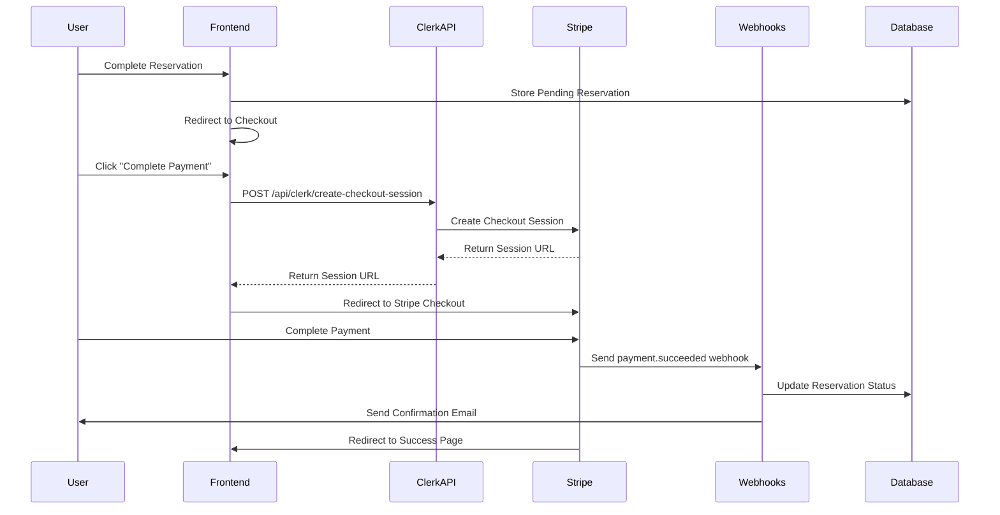

# Design Document

## Overview

This design addresses the critical payment integration issue in the reservation system where users are not properly redirected to Stripe for payment processing. The current implementation has a disconnect between the frontend payment form and the backend Stripe integration, resulting in fake success pages instead of real payment processing.

## Architecture

### Current State Analysis

**Problems Identified:**

1. `EnhancedPaymentForm` calls `/api/clerk/create-checkout-session` but the actual endpoint is at `/api/clerk/create-checkout-session`
2. The payment flow bypasses Stripe checkout and shows fake success messages
3. No proper webhook handling for reservation payment confirmations
4. Missing integration between reservation system and payment processing
5. Inconsistent error handling across payment flows

**Root Cause:**
The frontend component is correctly structured but is calling the wrong API endpoint, and the backend lacks proper integration between the reservation system and Stripe payment processing.

### Target Architecture



## Components and Interfaces

### 1. Frontend Payment Flow

**EnhancedPaymentForm Component Updates:**

- Fix API endpoint URL to match actual backend route
- Improve error handling for network failures
- Add proper loading states during Stripe redirect
- Implement retry mechanisms for failed requests

**Checkout Page Enhancements:**

- Ensure proper session storage management
- Add validation for pending services before payment
- Implement proper cleanup after successful payment

### 2. Backend API Integration

**Clerk Route Enhancements (`server/routes/clerk.ts`):**

- Enhance metadata handling for reservation payments
- Add proper validation for reservation-specific payments
- Implement proper error responses for frontend consumption
- Add logging for payment flow debugging

**New Reservation Payment Integration:**

- Create dedicated endpoint for reservation payments
- Link reservation IDs to Stripe checkout sessions
- Implement proper status tracking throughout payment flow

### 3. Webhook Processing

**Stripe Webhook Handler Updates:**

- Add reservation-specific webhook processing
- Implement reservation status updates on payment success
- Add email notifications for confirmed reservations
- Ensure idempotent processing of duplicate webhooks

## Data Models

### Enhanced Checkout Session Metadata

```typescript
interface ReservationCheckoutMetadata {
  userId: string;
  userEmail: string;
  type: "reservation_payment" | "mixed_cart" | "beats_only";
  reservationIds?: string[]; // For service reservations
  cartItemIds?: string[]; // For beat purchases
  servicesCount: string;
  servicesTotal: string;
  cartCount: string;
  cartTotal: string;
  orderTotal: string;
  description: string;
}
```

### Reservation Status Updates

```typescript
interface ReservationPaymentUpdate {
  reservationId: string;
  paymentStatus: "pending" | "processing" | "succeeded" | "failed";
  stripeSessionId?: string;
  stripePaymentIntentId?: string;
  paidAmount?: number;
  paidCurrency?: string;
  paidAt?: Date;
}
```

## Error Handling

### Frontend Error Scenarios

1. **Network Failures:**
   - Display user-friendly error messages
   - Provide retry buttons
   - Preserve user data during retries

2. **API Errors:**
   - Parse and display specific error messages from backend
   - Handle authentication errors with re-login prompts
   - Provide fallback options for payment processing

3. **Stripe Integration Errors:**
   - Handle Stripe API failures gracefully
   - Provide alternative payment methods if available
   - Log errors for debugging while protecting user privacy

### Backend Error Scenarios

1. **Stripe API Failures:**
   - Implement exponential backoff for retries
   - Log detailed error information for debugging
   - Return structured error responses to frontend

2. **Database Failures:**
   - Implement transaction rollbacks for failed operations
   - Provide data consistency checks
   - Handle concurrent reservation updates

3. **Webhook Processing Failures:**
   - Implement dead letter queues for failed webhooks
   - Provide manual reconciliation tools
   - Ensure payment confirmations are not lost

## Testing Strategy

### Unit Tests

1. **Frontend Components:**
   - Test payment form submission with various data combinations
   - Test error handling for different failure scenarios
   - Test proper cleanup after successful payments

2. **Backend API Endpoints:**
   - Test checkout session creation with valid/invalid data
   - Test webhook processing with various Stripe events
   - Test error handling and response formatting

### Integration Tests

1. **End-to-End Payment Flow:**
   - Test complete reservation-to-payment flow
   - Test mixed cart (services + beats) payments
   - Test payment cancellation and retry scenarios

2. **Webhook Processing:**
   - Test webhook signature validation
   - Test reservation status updates
   - Test email notification sending

### Manual Testing Scenarios

1. **Happy Path Testing:**
   - Complete reservation and payment flow
   - Verify Stripe redirect and return flow
   - Confirm reservation status updates

2. **Error Path Testing:**
   - Test with invalid payment methods
   - Test network interruptions during payment
   - Test webhook delivery failures

## Security Considerations

### Payment Data Protection

1. **PCI Compliance:**
   - Ensure no payment card data is stored locally
   - Use Stripe's secure checkout for all payment processing
   - Implement proper data encryption for sensitive metadata

2. **Authentication Security:**
   - Validate user authentication before payment processing
   - Implement proper session management
   - Protect against CSRF attacks in payment flows

### Webhook Security

1. **Signature Validation:**
   - Verify all webhook signatures using Stripe's validation
   - Implement additional security headers validation
   - Log and alert on invalid webhook attempts

2. **Idempotency Protection:**
   - Prevent duplicate processing of webhook events
   - Implement proper event deduplication
   - Handle webhook replay attacks

## Performance Considerations

### Frontend Optimization

1. **Loading States:**
   - Implement proper loading indicators during API calls
   - Optimize component re-renders during payment flow
   - Cache user data to prevent re-fetching

2. **Error Recovery:**
   - Implement efficient retry mechanisms
   - Minimize data loss during error scenarios
   - Optimize error message display

### Backend Optimization

1. **API Response Times:**
   - Optimize Stripe API calls with proper timeout handling
   - Implement caching for frequently accessed data
   - Use connection pooling for database operations

2. **Webhook Processing:**
   - Implement asynchronous webhook processing
   - Use queues for high-volume webhook handling
   - Optimize database operations for webhook updates

## Deployment Considerations

### Environment Configuration

1. **Stripe Configuration:**
   - Ensure proper API keys for each environment
   - Configure webhook endpoints for each deployment
   - Set up proper error monitoring and alerting

2. **Database Migration:**
   - Plan for reservation status field updates
   - Implement backward compatibility during deployment
   - Prepare rollback procedures for failed deployments

### Monitoring and Alerting

1. **Payment Flow Monitoring:**
   - Track payment success/failure rates
   - Monitor API response times and error rates
   - Set up alerts for critical payment failures

2. **Business Metrics:**
   - Track reservation conversion rates
   - Monitor revenue impact of payment fixes
   - Measure customer satisfaction improvements
