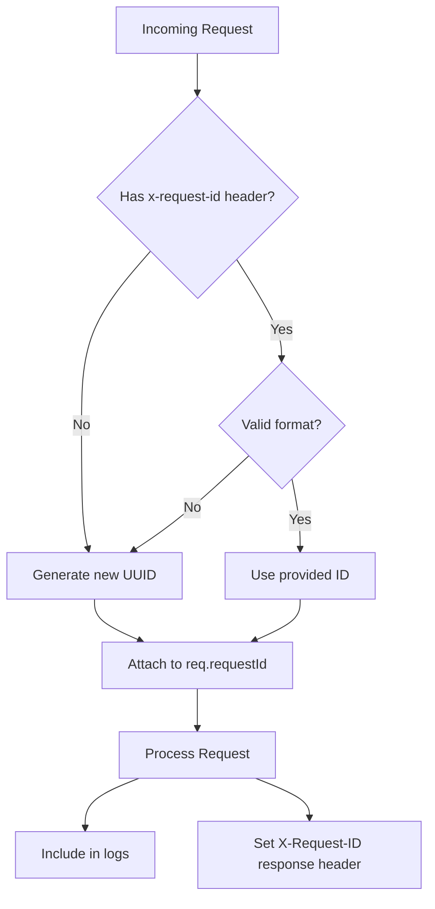

# Design Document: Secure Request ID

## Overview

This feature replaces the current `Date.now()`-based request ID generation with a cryptographically secure UUID v4 implementation. The solution centralizes ID generation in a single utility module, validates incoming request IDs, and propagates IDs through logs and response headers for improved traceability.

## Architecture



## Components and Interfaces

### 1. Request ID Utility Module

**Location:** `server/utils/requestId.ts`

```typescript
/**
 * Generates a cryptographically secure request ID using UUID v4
 * @returns Request ID in format "req_<uuid-v4>"
 */
export function generateSecureRequestId(): string;

/**
 * Validates a request ID format
 * Accepts both legacy (Date.now) and new (UUID) formats
 * @param id - The request ID to validate
 * @returns true if valid, false otherwise
 */
export function isValidRequestId(id: string): boolean;

/**
 * @deprecated Use generateSecureRequestId instead
 * Maintained for backward compatibility
 */
export function generateRequestId(): string;
```

### 2. Request ID Middleware

**Location:** `server/middleware/requestId.ts`

```typescript
import { Request, Response, NextFunction } from "express";

/**
 * Express middleware that assigns a unique request ID to each request
 * - Uses provided x-request-id header if valid
 * - Generates new secure ID otherwise
 * - Sets X-Request-ID response header
 */
export function requestIdMiddleware(
  req: Request & { requestId?: string },
  res: Response,
  next: NextFunction
): void;
```

### 3. Updated Express Types

**Location:** `server/types/express.ts`

```typescript
export interface AuthenticatedRequest extends Request {
  requestId: string; // Now guaranteed to be present
  user?: ConvexUser;
}
```

## Data Models

### Request ID Format

| Format               | Pattern                    | Example                                    |
| -------------------- | -------------------------- | ------------------------------------------ |
| New (UUID v4)        | `req_<uuid-v4>`            | `req_550e8400-e29b-41d4-a716-446655440000` |
| Legacy (Date.now)    | `req_<timestamp>`          | `req_1702345678901`                        |
| Legacy (with random) | `req_<timestamp>_<random>` | `req_1702345678901_abc123def`              |

### Validation Regex

```typescript
// Accepts all valid formats
const REQUEST_ID_PATTERN = /^req_[a-zA-Z0-9_-]+$/;
```

## Correctness Properties

_A property is a characteristic or behavior that should hold true across all valid executions of a system-essentially, a formal statement about what the system should do. Properties serve as the bridge between human-readable specifications and machine-verifiable correctness guarantees._

### Property 1: UUID v4 Format Compliance

_For any_ generated request ID, the UUID portion (after "req\_" prefix) SHALL match the UUID v4 format pattern (8-4-4-4-12 hexadecimal characters with hyphens).

**Validates: Requirements 1.1, 3.2**

### Property 2: Uniqueness Under Concurrent Generation

_For any_ set of N request IDs generated concurrently (where N ≤ 10000), all IDs in the set SHALL be distinct.

**Validates: Requirements 1.2**

### Property 3: Consistent Prefix Format

_For any_ generated request ID, the string SHALL start with the prefix "req\_".

**Validates: Requirements 1.3**

### Property 4: Validation Accepts Valid Formats

_For any_ string matching the pattern `req_[a-zA-Z0-9_-]+`, the isValidRequestId function SHALL return true.

**Validates: Requirements 2.2, 3.3**

### Property 5: Validation Rejects Invalid Formats

_For any_ string NOT matching the pattern `req_[a-zA-Z0-9_-]+` (including empty strings, strings without prefix, strings with invalid characters), the isValidRequestId function SHALL return false.

**Validates: Requirements 2.2, 2.3**

### Property 6: Backward Compatibility with Legacy Formats

_For any_ legacy request ID in format `req_<timestamp>` or `req_<timestamp>_<random>`, the isValidRequestId function SHALL return true.

**Validates: Requirements 5.1**

## Error Handling

| Scenario                             | Behavior                                            |
| ------------------------------------ | --------------------------------------------------- |
| Invalid x-request-id header          | Generate new secure ID, log warning                 |
| crypto.randomUUID() failure          | Fall back to crypto.randomBytes(16).toString('hex') |
| Missing requestId in downstream code | TypeScript will catch at compile time               |

## Testing Strategy

### Property-Based Testing

**Library:** fast-check (already available in project via Jest ecosystem)

Property-based tests will verify:

- UUID format compliance across many generated IDs
- Uniqueness under rapid concurrent generation
- Validation function correctness with random inputs
- Backward compatibility with legacy format patterns

### Unit Tests

- `generateSecureRequestId()` returns valid format
- `isValidRequestId()` accepts valid IDs
- `isValidRequestId()` rejects invalid IDs
- Middleware attaches requestId to request
- Middleware sets response header
- Middleware uses provided header when valid
- Middleware generates new ID when header invalid

### Integration Tests

- Request flow with valid x-request-id header
- Request flow without x-request-id header
- Request flow with invalid x-request-id header
- Log entries contain requestId field
