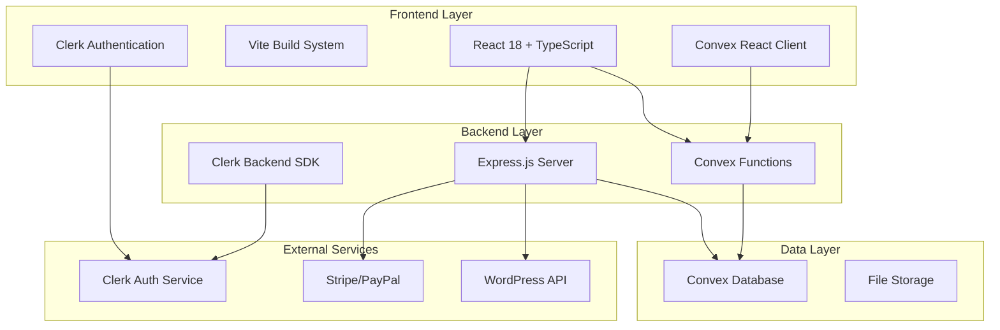
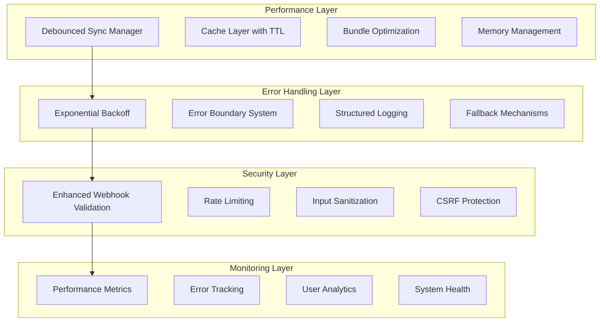

# Design Document

## Overview

This design document outlines a comprehensive system optimization strategy for the BroLab Entertainment platform. The system is built on a modern tech stack including React 18, TypeScript, Convex (backend-as-a-service), Clerk (authentication), Express.js server, and Vite (build tool). The optimization focuses on addressing critical performance bottlenecks, implementing robust error handling, enhancing security measures, and building advanced monitoring capabilities.

The current system faces several critical issues identified through TestSprite testing: 80% test failure rate due to Clerk billing configuration issues, performance problems including memory leaks and slow page loads, missing error handling mechanisms, and type safety concerns with widespread use of 'any' types.

## Architecture

### Current System Architecture



### Optimized Architecture Design



## Components and Interfaces

### 1. Performance Optimization Components

#### Debounced Sync Manager

```typescript
interface SyncManager {
  scheduleSync(operation: SyncOperation): Promise<void>;
  cancelPendingSync(operationId: string): void;
  getSyncStatus(): SyncStatus;
}

interface SyncOperation {
  id: string;
  type: "user" | "data" | "preferences";
  payload: any;
  priority: "low" | "medium" | "high";
  retryCount: number;
}
```

#### Cache Layer

```typescript
interface CacheManager {
  get<T>(key: string): Promise<T | null>;
  set<T>(key: string, value: T, ttl?: number): Promise<void>;
  invalidate(pattern: string): Promise<void>;
  clear(): Promise<void>;
}

interface CacheConfig {
  defaultTTL: number;
  maxSize: number;
  strategy: "LRU" | "LFU" | "FIFO";
}
```

#### Bundle Optimization

```typescript
interface BundleOptimizer {
  analyzeBundleSize(): BundleAnalysis;
  implementCodeSplitting(): void;
  optimizeAssets(): Promise<void>;
}

interface BundleAnalysis {
  totalSize: number;
  chunks: ChunkInfo[];
  recommendations: OptimizationRecommendation[];
}
```

### 2. Error Handling Components

#### Exponential Backoff System

```typescript
interface RetryManager {
  executeWithRetry<T>(operation: () => Promise<T>, config: RetryConfig): Promise<T>;
}

interface RetryConfig {
  maxRetries: number;
  baseDelay: number;
  maxDelay: number;
  backoffFactor: number;
  retryCondition: (error: Error) => boolean;
}
```

#### Error Boundary System

```typescript
interface ErrorBoundaryManager {
  captureError(error: Error, context: ErrorContext): void;
  getErrorRecoveryOptions(error: Error): RecoveryOption[];
  reportError(error: Error): Promise<void>;
}

interface ErrorContext {
  component: string;
  action: string;
  userId?: string;
  timestamp: number;
  metadata: Record<string, any>;
}
```

### 3. Security Enhancement Components

#### Enhanced Webhook Validation

```typescript
interface WebhookValidator {
  validateSignature(payload: string, signature: string, secret: string): boolean;
  validateTimestamp(timestamp: number, tolerance: number): boolean;
  sanitizePayload(payload: any): any;
}

interface SecurityConfig {
  webhookSecrets: Record<string, string>;
  timestampTolerance: number;
  rateLimits: RateLimitConfig[];
}
```

#### Rate Limiting System

```typescript
interface RateLimiter {
  checkLimit(key: string, limit: RateLimit): Promise<RateLimitResult>;
  resetLimit(key: string): Promise<void>;
}

interface RateLimit {
  windowMs: number;
  maxRequests: number;
  skipSuccessfulRequests?: boolean;
  skipFailedRequests?: boolean;
}
```

### 4. Monitoring and Analytics Components

#### Performance Monitor

```typescript
interface PerformanceMonitor {
  trackMetric(name: string, value: number, tags?: Record<string, string>): void;
  startTimer(name: string): Timer;
  recordWebVitals(vitals: WebVitals): void;
}

interface WebVitals {
  FCP: number; // First Contentful Paint
  LCP: number; // Largest Contentful Paint
  CLS: number; // Cumulative Layout Shift
  FID: number; // First Input Delay
  TTFB: number; // Time to First Byte
}
```

#### Error Tracking System

```typescript
interface ErrorTracker {
  trackError(error: Error, context: ErrorContext): void;
  getErrorStats(timeRange: TimeRange): ErrorStats;
  getErrorTrends(): ErrorTrend[];
}

interface ErrorStats {
  totalErrors: number;
  errorsByType: Record<string, number>;
  errorsByComponent: Record<string, number>;
  resolutionRate: number;
}
```

## Data Models

### 1. Performance Metrics Schema

```typescript
interface PerformanceMetric {
  id: string;
  name: string;
  value: number;
  unit: string;
  timestamp: number;
  tags: Record<string, string>;
  sessionId: string;
  userId?: string;
}
```

### 2. Error Log Schema

```typescript
interface ErrorLog {
  id: string;
  message: string;
  stack: string;
  level: "error" | "warning" | "info";
  component: string;
  action: string;
  userId?: string;
  sessionId: string;
  timestamp: number;
  metadata: Record<string, any>;
  resolved: boolean;
  resolutionNotes?: string;
}
```

### 3. Cache Entry Schema

```typescript
interface CacheEntry {
  key: string;
  value: any;
  createdAt: number;
  expiresAt: number;
  accessCount: number;
  lastAccessed: number;
  size: number;
}
```

### 4. Sync Operation Schema

```typescript
interface SyncOperationLog {
  id: string;
  type: string;
  status: "pending" | "in_progress" | "completed" | "failed";
  payload: any;
  startedAt: number;
  completedAt?: number;
  retryCount: number;
  errorMessage?: string;
  userId?: string;
}
```

## Error Handling

### 1. Error Classification System

```typescript
enum ErrorType {
  NETWORK_ERROR = "network_error",
  VALIDATION_ERROR = "validation_error",
  AUTHENTICATION_ERROR = "auth_error",
  AUTHORIZATION_ERROR = "authz_error",
  RATE_LIMIT_ERROR = "rate_limit_error",
  SERVER_ERROR = "server_error",
  CLIENT_ERROR = "client_error",
  UNKNOWN_ERROR = "unknown_error",
}

interface ErrorHandler {
  handleError(error: Error, type: ErrorType): Promise<ErrorResponse>;
  getRecoveryStrategy(error: Error): RecoveryStrategy;
}
```

### 2. Graceful Degradation Strategy

```typescript
interface FallbackManager {
  registerFallback(feature: string, fallback: FallbackFunction): void;
  executeFallback(feature: string, context: any): Promise<any>;
  isFallbackActive(feature: string): boolean;
}

type FallbackFunction = (context: any) => Promise<any>;
```

### 3. User-Friendly Error Messages

```typescript
interface ErrorMessageProvider {
  getErrorMessage(error: Error, locale: string): string;
  getRecoveryInstructions(error: Error, locale: string): string[];
  shouldShowTechnicalDetails(error: Error, userRole: string): boolean;
}
```

## Testing Strategy

### 1. Performance Testing

- **Load Testing**: Simulate high user concurrency
- **Memory Leak Detection**: Monitor memory usage patterns
- **Bundle Size Monitoring**: Track bundle size changes
- **Web Vitals Testing**: Automated Core Web Vitals measurement

### 2. Error Handling Testing

- **Fault Injection**: Simulate various failure scenarios
- **Recovery Testing**: Verify error recovery mechanisms
- **Retry Logic Testing**: Test exponential backoff behavior
- **Fallback Testing**: Ensure graceful degradation works

### 3. Security Testing

- **Rate Limit Testing**: Verify rate limiting effectiveness
- **Webhook Security Testing**: Test signature validation
- **Input Validation Testing**: Test sanitization mechanisms
- **Authentication Testing**: Verify security token handling

### 4. Integration Testing

- **API Endpoint Testing**: Comprehensive API testing
- **Cross-Browser Testing**: Ensure compatibility
- **Mobile Performance Testing**: Test on various devices
- **Offline Functionality Testing**: Test offline capabilities

### 5. Monitoring Testing

- **Metrics Collection Testing**: Verify data collection
- **Alert System Testing**: Test notification systems
- **Dashboard Testing**: Verify monitoring interfaces
- **Data Retention Testing**: Test data lifecycle management

## Implementation Phases

### Phase 1: Critical Fixes (Week 1)

1. **Performance Optimization**
   - Implement debounced sync manager
   - Add caching layer with TTL
   - Fix memory leaks identified in tests
   - Implement code splitting for large components

2. **Error Handling Enhancement**
   - Add exponential backoff for API calls
   - Implement user-friendly error messages
   - Create error boundary system
   - Add structured logging

3. **Type Safety Improvements**
   - Replace all 'any' types with proper interfaces
   - Add runtime type validation
   - Implement schema validation for API responses

### Phase 2: Security & UX (Week 2)

1. **Security Enhancements**
   - Implement enhanced webhook validation
   - Add comprehensive rate limiting
   - Strengthen authentication token handling
   - Add security audit logging

2. **User Experience Improvements**
   - Add loading states for all async operations
   - Implement offline support for critical functions
   - Add optimistic updates for immediate feedback
   - Improve error recovery options

### Phase 3: Advanced Features (Week 3)

1. **Advanced Monitoring**
   - Implement comprehensive performance monitoring
   - Add user behavior analytics
   - Create real-time error tracking
   - Build monitoring dashboards

2. **Data Consistency**
   - Implement conflict resolution mechanisms
   - Add rollback capabilities for failed operations
   - Ensure data synchronization consistency
   - Add data integrity checks

This design provides a comprehensive foundation for transforming the BroLab platform into a robust, performant, and secure system that can handle production workloads effectively.
