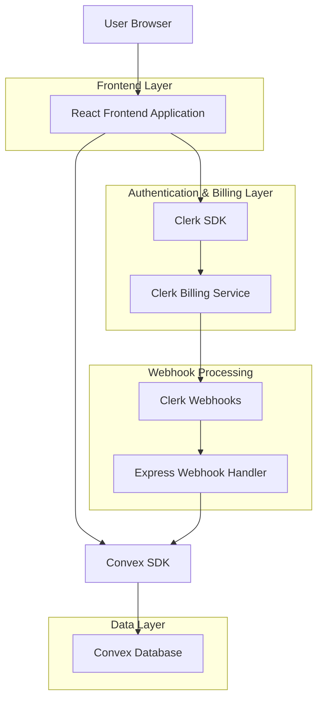
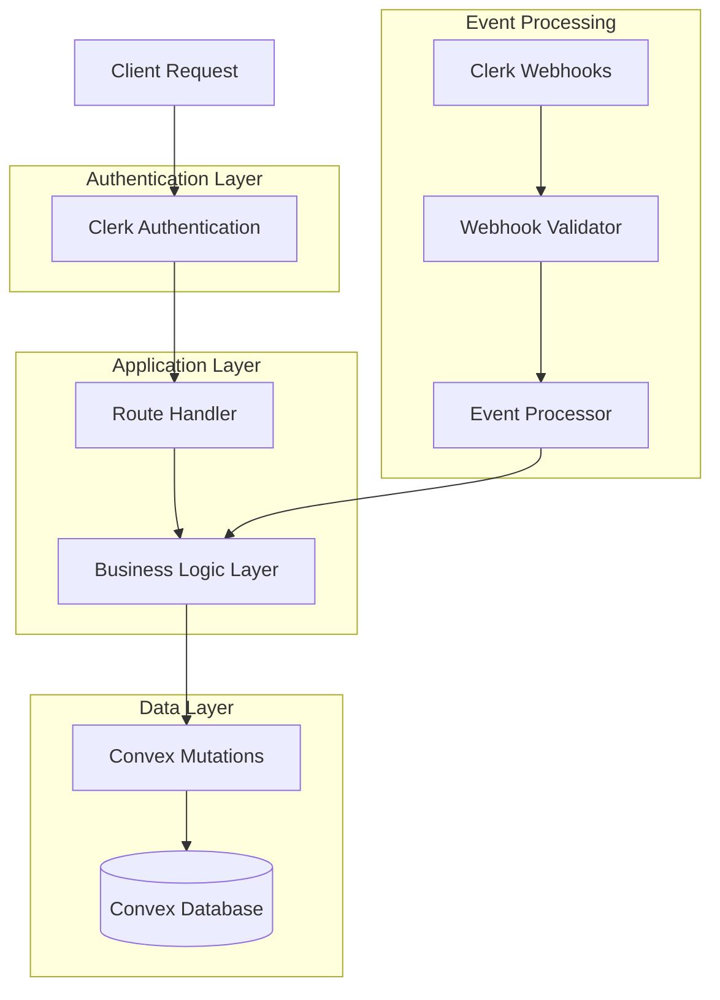
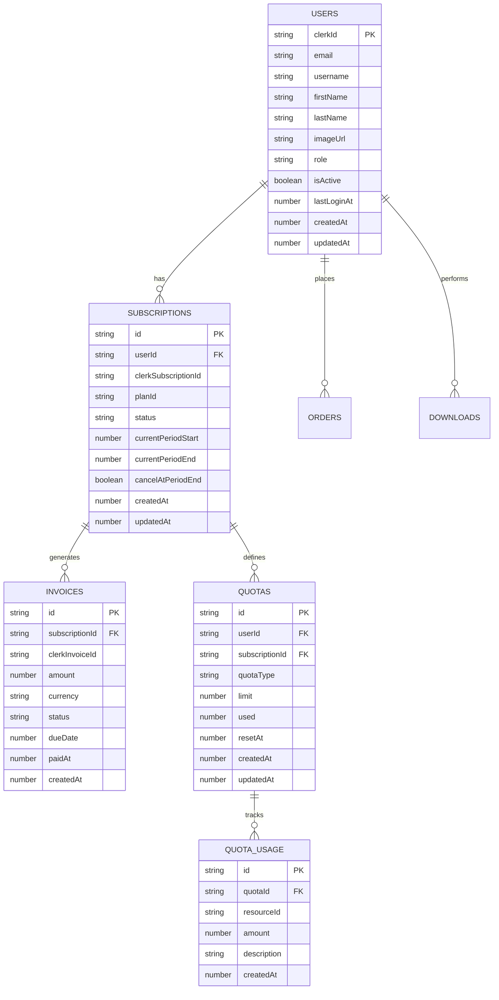

# Architecture Technique Phase 3 - Système Paiement Clerk Billing
*BroLab Entertainment - Janvier 2025*

## 1. Architecture Design



## 2. Technology Description

- **Frontend**: React@18 + TypeScript + Vite + Tailwind CSS
- **Authentication**: Clerk (avec Billing addon)
- **Database**: Convex (PostgreSQL compatible)
- **Webhooks**: Express.js middleware
- **Paiements**: Clerk Billing (Stripe backend)

## 3. Route Definitions

| Route | Purpose |
|-------|----------|
| /dashboard | Dashboard utilisateur avec informations abonnement |
| /membership | Page de sélection et gestion des plans |
| /checkout | Processus de paiement Clerk |
| /billing | Gestion facturation et historique |
| /subscription/success | Confirmation d'abonnement |
| /subscription/cancel | Annulation d'abonnement |

## 4. API Definitions

### 4.1 Clerk Billing Integration

#### Subscription Management
```typescript
// Créer un abonnement
POST /api/clerk/subscription/create
```

Request:
| Param Name | Param Type | isRequired | Description |
|------------|------------|------------|-------------|
| planId | string | true | ID du plan d'abonnement |
| userId | string | true | ID utilisateur Clerk |
| paymentMethodId | string | true | ID méthode de paiement |

Response:
| Param Name | Param Type | Description |
|------------|------------|-------------|
| subscriptionId | string | ID de l'abonnement créé |
| status | string | Statut de l'abonnement |
| nextBillingDate | string | Date de prochaine facturation |

Example:
```json
{
  "planId": "basic_plan",
  "userId": "user_123",
  "paymentMethodId": "pm_456"
}
```

#### Webhook Events
```typescript
// Traitement des webhooks Clerk
POST /api/webhooks/clerk
```

Request:
| Param Name | Param Type | isRequired | Description |
|------------|------------|------------|-------------|
| type | string | true | Type d'événement webhook |
| data | object | true | Données de l'événement |
| timestamp | number | true | Timestamp de l'événement |

Events supportés:
- `subscription.created`
- `subscription.updated` 
- `subscription.cancelled`
- `invoice.payment_succeeded`
- `invoice.payment_failed`

### 4.2 Convex Mutations

#### Synchronisation Abonnement
```typescript
// convex/subscriptions/sync.ts
export const syncSubscription = mutation({
  args: {
    userId: v.string(),
    clerkSubscriptionId: v.string(),
    planId: v.string(),
    status: v.string(),
    currentPeriodStart: v.number(),
    currentPeriodEnd: v.number(),
    cancelAtPeriodEnd: v.boolean()
  },
  handler: async (ctx, args) => {
    // Synchroniser l'abonnement avec Convex
  }
});
```

#### Gestion Quotas
```typescript
// convex/subscriptions/quotas.ts
export const updateQuota = mutation({
  args: {
    userId: v.string(),
    quotaType: v.string(), // 'downloads', 'storage', etc.
    used: v.number(),
    limit: v.number()
  },
  handler: async (ctx, args) => {
    // Mettre à jour les quotas utilisateur
  }
});
```

## 5. Server Architecture Diagram



## 6. Data Model

### 6.1 Data Model Definition



### 6.2 Data Definition Language

#### Subscriptions Table
```sql
-- Convex Schema Definition
// convex/schema.ts

subscriptions: defineTable({
  userId: v.string(), // Référence vers users.clerkId
  clerkSubscriptionId: v.string(), // ID Clerk Billing
  planId: v.string(), // 'basic', 'artist', 'ultimate'
  status: v.string(), // 'active', 'cancelled', 'past_due', 'unpaid'
  currentPeriodStart: v.number(), // Timestamp début période
  currentPeriodEnd: v.number(), // Timestamp fin période
  cancelAtPeriodEnd: v.boolean(), // Annulation programmée
  trialEnd: v.optional(v.number()), // Fin de période d'essai
  metadata: v.optional(v.any()), // Métadonnées additionnelles
  createdAt: v.number(),
  updatedAt: v.number()
})
  .index("by_user", ["userId"])
  .index("by_clerk_id", ["clerkSubscriptionId"])
  .index("by_status", ["status"])
  .index("by_plan", ["planId"]),
```

#### Invoices Table
```sql
invoices: defineTable({
  subscriptionId: v.string(), // Référence vers subscriptions
  clerkInvoiceId: v.string(), // ID Clerk Billing
  amount: v.number(), // Montant en centimes
  currency: v.string(), // 'usd', 'eur', etc.
  status: v.string(), // 'paid', 'open', 'void', 'uncollectible'
  description: v.optional(v.string()),
  dueDate: v.number(), // Date d'échéance
  paidAt: v.optional(v.number()), // Date de paiement
  attemptCount: v.optional(v.number()), // Nombre de tentatives
  nextPaymentAttempt: v.optional(v.number()), // Prochaine tentative
  createdAt: v.number(),
  updatedAt: v.number()
})
  .index("by_subscription", ["subscriptionId"])
  .index("by_clerk_id", ["clerkInvoiceId"])
  .index("by_status", ["status"])
  .index("by_due_date", ["dueDate"]),
```

#### Quotas Table
```sql
quotas: defineTable({
  userId: v.string(), // Référence vers users.clerkId
  subscriptionId: v.optional(v.string()), // Référence vers subscriptions
  quotaType: v.string(), // 'downloads', 'storage', 'api_calls'
  limit: v.number(), // Limite autorisée
  used: v.number(), // Quantité utilisée
  resetAt: v.number(), // Timestamp de reset (mensuel)
  resetPeriod: v.string(), // 'monthly', 'daily', 'yearly'
  isActive: v.boolean(), // Quota actif
  createdAt: v.number(),
  updatedAt: v.number()
})
  .index("by_user", ["userId"])
  .index("by_subscription", ["subscriptionId"])
  .index("by_type", ["quotaType"])
  .index("by_reset", ["resetAt"]),
```

#### Quota Usage Table
```sql
quotaUsage: defineTable({
  quotaId: v.string(), // Référence vers quotas
  resourceId: v.string(), // ID de la ressource utilisée
  resourceType: v.string(), // 'download', 'upload', 'api_call'
  amount: v.number(), // Quantité consommée
  description: v.optional(v.string()),
  metadata: v.optional(v.any()), // Données additionnelles
  createdAt: v.number()
})
  .index("by_quota", ["quotaId"])
  .index("by_resource", ["resourceId"])
  .index("by_type", ["resourceType"])
  .index("by_date", ["createdAt"]),
```

## 7. Webhook Implementation

### 7.1 Webhook Handler

```typescript
// server/routes/webhooks/clerk.ts
import { Request, Response } from 'express';
import { Webhook } from 'svix';
import { api } from '../../../convex/_generated/api';
import { ConvexHttpClient } from 'convex/browser';

const convex = new ConvexHttpClient(process.env.CONVEX_URL!);

export async function handleClerkWebhook(req: Request, res: Response) {
  const WEBHOOK_SECRET = process.env.CLERK_WEBHOOK_SECRET;
  
  if (!WEBHOOK_SECRET) {
    throw new Error('CLERK_WEBHOOK_SECRET is required');
  }
  
  const headers = req.headers;
  const payload = JSON.stringify(req.body);
  
  const wh = new Webhook(WEBHOOK_SECRET);
  let event;
  
  try {
    event = wh.verify(payload, headers) as any;
  } catch (err) {
    console.error('Webhook verification failed:', err);
    return res.status(400).json({ error: 'Webhook verification failed' });
  }
  
  try {
    await processWebhookEvent(event);
    res.status(200).json({ received: true });
  } catch (error) {
    console.error('Webhook processing failed:', error);
    res.status(500).json({ error: 'Webhook processing failed' });
  }
}

async function processWebhookEvent(event: any) {
  switch (event.type) {
    case 'subscription.created':
      await handleSubscriptionCreated(event.data);
      break;
      
    case 'subscription.updated':
      await handleSubscriptionUpdated(event.data);
      break;
      
    case 'subscription.cancelled':
      await handleSubscriptionCancelled(event.data);
      break;
      
    case 'invoice.payment_succeeded':
      await handlePaymentSucceeded(event.data);
      break;
      
    case 'invoice.payment_failed':
      await handlePaymentFailed(event.data);
      break;
      
    default:
      console.log(`Unhandled webhook event: ${event.type}`);
  }
}

async function handleSubscriptionCreated(data: any) {
  await convex.mutation(api.subscriptions.sync.syncSubscription, {
    userId: data.user_id,
    clerkSubscriptionId: data.id,
    planId: data.plan_id,
    status: data.status,
    currentPeriodStart: data.current_period_start * 1000,
    currentPeriodEnd: data.current_period_end * 1000,
    cancelAtPeriodEnd: data.cancel_at_period_end
  });
  
  // Initialiser les quotas pour le nouveau plan
  await initializeQuotasForPlan(data.user_id, data.plan_id);
}

async function initializeQuotasForPlan(userId: string, planId: string) {
  const planLimits = getPlanLimits(planId);
  
  for (const [quotaType, limit] of Object.entries(planLimits)) {
    await convex.mutation(api.quotas.create, {
      userId,
      quotaType,
      limit: limit as number,
      used: 0,
      resetAt: getNextResetDate(),
      resetPeriod: 'monthly'
    });
  }
}

function getPlanLimits(planId: string): Record<string, number> {
  const limits = {
    basic: { downloads: 5, storage: 1000 }, // 1GB
    artist: { downloads: 20, storage: 5000 }, // 5GB
    ultimate: { downloads: -1, storage: -1 } // Unlimited
  };
  
  return limits[planId as keyof typeof limits] || { downloads: 0, storage: 0 };
}

function getNextResetDate(): number {
  const now = new Date();
  const nextMonth = new Date(now.getFullYear(), now.getMonth() + 1, 1);
  return nextMonth.getTime();
}
```

## 8. Frontend Integration

### 8.1 Subscription Management Component

```typescript
// client/src/components/SubscriptionManager.tsx
import { useUser } from '@clerk/clerk-react';
import { useQuery, useMutation } from 'convex/react';
import { api } from '../../../convex/_generated/api';
import { Card, CardContent, CardHeader, CardTitle } from '@/components/ui/card';
import { Button } from '@/components/ui/button';
import { Badge } from '@/components/ui/badge';
import { SUBSCRIPTION_PLANS } from '../../shared/subscription-plans';

export function SubscriptionManager() {
  const { user } = useUser();
  const subscription = useQuery(api.subscriptions.getCurrentSubscription, 
    user ? { userId: user.id } : 'skip'
  );
  const createCheckout = useMutation(api.subscriptions.createCheckoutSession);
  
  const handleUpgrade = async (planId: string) => {
    if (!user) return;
    
    try {
      const session = await createCheckout({
        userId: user.id,
        planId,
        successUrl: `${window.location.origin}/subscription/success`,
        cancelUrl: `${window.location.origin}/membership`
      });
      
      window.location.href = session.url;
    } catch (error) {
      console.error('Failed to create checkout session:', error);
    }
  };
  
  const currentPlan = subscription?.planId || 'free';
  
  return (
    <div className="space-y-6">
      <Card className="bg-gray-900 border-gray-700">
        <CardHeader>
          <CardTitle className="text-white">Abonnement Actuel</CardTitle>
        </CardHeader>
        <CardContent>
          <div className="flex items-center justify-between">
            <div>
              <h3 className="text-xl font-semibold text-white">
                Plan {SUBSCRIPTION_PLANS[currentPlan as keyof typeof SUBSCRIPTION_PLANS]?.name || 'Gratuit'}
              </h3>
              <p className="text-gray-400">
                {subscription?.status === 'active' ? 'Actif' : 'Inactif'}
              </p>
            </div>
            <Badge className={subscription?.status === 'active' ? 'bg-green-500' : 'bg-gray-500'}>
              {subscription?.status || 'free'}
            </Badge>
          </div>
          
          {subscription?.currentPeriodEnd && (
            <p className="text-sm text-gray-400 mt-2">
              Renouvellement le {new Date(subscription.currentPeriodEnd).toLocaleDateString('fr-FR')}
            </p>
          )}
        </CardContent>
      </Card>
      
      <div className="grid grid-cols-1 md:grid-cols-3 gap-6">
        {Object.entries(SUBSCRIPTION_PLANS).map(([planId, plan]) => (
          <Card key={planId} className="bg-gray-900 border-gray-700">
            <CardHeader>
              <CardTitle className="text-white">{plan.name}</CardTitle>
              <div className="text-2xl font-bold text-orange-500">
                ${(plan.price / 100).toFixed(2)}
                <span className="text-sm text-gray-400">/mois</span>
              </div>
            </CardHeader>
            <CardContent>
              <ul className="space-y-2 mb-4">
                {plan.features.map((feature) => (
                  <li key={feature} className="text-sm text-gray-300">
                    ✓ {feature.replace('_', ' ')}
                  </li>
                ))}
              </ul>
              
              <Button
                className="w-full"
                variant={currentPlan === planId ? 'secondary' : 'default'}
                disabled={currentPlan === planId}
                onClick={() => handleUpgrade(planId)}
              >
                {currentPlan === planId ? 'Plan Actuel' : 'Choisir ce Plan'}
              </Button>
            </CardContent>
          </Card>
        ))}
      </div>
    </div>
  );
}
```

## 9. Security Considerations

### 9.1 Webhook Security
- Vérification signature Clerk avec svix
- Validation des données webhook
- Rate limiting sur les endpoints webhook
- Logs détaillés pour audit

### 9.2 Data Protection
- Chiffrement des données sensibles
- Conformité PCI DSS via Clerk/Stripe
- Anonymisation des logs
- Backup sécurisé des données

### 9.3 Access Control
- Vérification des permissions par plan
- Validation côté serveur des quotas
- Protection contre les abus
- Monitoring des usages anormaux

## 10. Testing Strategy

### 10.1 Unit Tests
- Tests des mutations Convex
- Tests des hooks React
- Tests des utilitaires de validation

### 10.2 Integration Tests
- Tests des webhooks Clerk
- Tests des flux de paiement
- Tests de synchronisation des données

### 10.3 E2E Tests
- Parcours complet d'abonnement
- Tests de gestion des quotas
- Tests de facturation

Cette architecture Phase 3 assure une intégration robuste et sécurisée du système de paiement Clerk Billing avec l'infrastructure existante BroLab.
