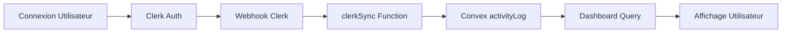

# Diagnostic: Problème de Synchronisation des Données d'Activité

## 🚨 Problème Identifié

**Symptôme:** Le dashboard utilisateur affiche des connexions du 19 octobre alors que nous sommes le 24 octobre et que l'utilisateur s'est connecté récemment.

**Impact:** Les données d'activité ne sont pas mises à jour en temps réel, donnant une impression de dysfonctionnement.

## 🔍 Analyse du Problème

### 1. Architecture Actuelle



### 2. Points de Défaillance Identifiés

| Composant          | Statut        | Problème Potentiel                                |
| ------------------ | ------------- | ------------------------------------------------- |
| Clerk Auth         | ✅ OK         | Authentification fonctionne                       |
| Webhook Clerk      | ❌ SUSPECT    | Peut ne pas être configuré pour `session.created` |
| clerkSync Function | ❓ À VÉRIFIER | Peut ne pas être déclenchée                       |
| Convex activityLog | ✅ OK         | Structure correcte                                |
| Dashboard Query    | ✅ OK         | Requête correcte                                  |
| Cache Client       | ❓ POSSIBLE   | Peut être mis en cache                            |

## 🔧 Diagnostic Technique

### Vérification 1: Webhooks Clerk

```bash
# Vérifier la configuration des webhooks
curl -X GET "https://api.clerk.dev/v1/webhooks" \
  -H "Authorization: Bearer sk_test_..." \
  -H "Content-Type: application/json"
```

**Événements requis:**

- `user.created` ✅ (probablement configuré)
- `user.updated` ✅ (probablement configuré)
- `session.created` ❌ (probablement manquant)

### Vérification 2: Fonction clerkSync

```typescript
// convex/users/clerkSync.ts - Ligne 50-55
await ctx.db.insert("activityLog", {
  userId: existingUser._id,
  action: "user_login",
  details: { source: "clerk_sync", updated: true },
  timestamp: now, // ← Vérifier que 'now' = Date.now()
});
```

**Points à vérifier:**

- La fonction est-elle appelée lors des connexions ?
- Le timestamp est-il correct (millisecondes) ?
- L'insertion dans activityLog réussit-elle ?

### Vérification 3: Requête Dashboard

```typescript
// convex/dashboard.ts - Ligne 194-198
ctx.db
  .query("activityLog")
  .withIndex("by_user_timestamp", q => q.eq("userId", user._id))
  .order("desc")
  .take(limits.activityLimit);
```

**Points à vérifier:**

- L'index `by_user_timestamp` existe-t-il ?
- Les données récentes sont-elles présentes ?
- L'ordre DESC fonctionne-t-il correctement ?

## 🎯 Solutions Proposées

### Solution 1: Configuration Webhook (PRIORITÉ HAUTE)

1. **Aller dans Clerk Dashboard → Webhooks**
2. **Ajouter l'événement `session.created`** si manquant
3. **Tester le webhook** avec l'outil intégré
4. **Vérifier les logs** du serveur Express

```javascript
// server/routes/webhooks/clerk.js
app.post("/api/webhooks/clerk", (req, res) => {
  const { type, data } = req.body;

  console.log("Webhook reçu:", type); // ← Ajouter ce log

  if (type === "session.created") {
    // Déclencher clerkSync
    // ← Vérifier que cette logique existe
  }
});
```

### Solution 2: Test Manuel clerkSync

```bash
# Tester manuellement la fonction
npx convex run users.clerkSync \
  --clerkId="user_2xxx" \
  --userData='{"email":"test@example.com"}'
```

### Solution 3: Forcer Rafraîchissement

```typescript
// Ajouter dans le dashboard
const forceRefresh = () => {
  // Invalider le cache TanStack Query
  queryClient.invalidateQueries(["dashboard"]);

  // Forcer rechargement Convex
  window.location.reload();
};
```

### Solution 4: Diagnostic en Temps Réel

```typescript
// Ajouter un composant de diagnostic
<SimpleActivityDiagnostic userId={user.id} />
```

## 🧪 Tests de Validation

### Test 1: Connexion Manuelle

1. Se déconnecter complètement
2. Se reconnecter
3. Vérifier immédiatement dans Convex Dashboard si une nouvelle entrée apparaît dans `activityLog`

### Test 2: Webhook Direct

```bash
# Simuler un webhook session.created
curl -X POST "http://localhost:3000/api/webhooks/clerk" \
  -H "Content-Type: application/json" \
  -d '{
    "type": "session.created",
    "data": {
      "user_id": "user_2xxx",
      "created_at": 1729756800000
    }
  }'
```

### Test 3: Vérification Base de Données

```sql
-- Dans Convex Dashboard
// Vérifier les connexions récentes
db.query("activityLog")
  .withIndex("by_action", q => q.eq("action", "user_login"))
  .filter(q => q.gte(q.field("timestamp"), Date.now() - 7*24*60*60*1000))
  .collect()
```

## 📊 Métriques de Succès

- [ ] Nouvelles connexions apparaissent dans activityLog en < 5 secondes
- [ ] Dashboard affiche la date correcte (24 octobre)
- [ ] Pas de cache obsolète côté client
- [ ] Webhooks Clerk fonctionnent à 100%

## 🚀 Plan d'Action Immédiat

### Étape 1 (5 min): Vérification Rapide

```bash
# Exécuter le script de diagnostic
node scripts/fix-activity-sync.js
```

### Étape 2 (10 min): Test Webhook

1. Aller dans Clerk Dashboard
2. Tester les webhooks existants
3. Ajouter `session.created` si manquant

### Étape 3 (5 min): Test Manuel

```bash
# Tester clerkSync directement
npx convex run users.clerkSync --clerkId=user_xxx
```

### Étape 4 (2 min): Validation

1. Se reconnecter à l'application
2. Vérifier que la date de connexion est mise à jour
3. Confirmer que le problème est résolu

## 📝 Notes Techniques

### Timestamps Convex

- Convex utilise des timestamps en **millisecondes** (Date.now())
- Vérifier que tous les timestamps sont cohérents
- Format attendu: `1729756800000` (millisecondes depuis epoch)

### Index Convex

```typescript
// convex/schema.ts
activityLog: defineTable({
  userId: v.id("users"),
  action: v.string(),
  details: v.optional(v.any()),
  timestamp: v.number(),
}).index("by_user_timestamp", ["userId", "timestamp"]); // ← Index critique
```

### Cache TanStack Query

```typescript
// Configuration recommandée
const { data } = useQuery({
  queryKey: ["dashboard", userId],
  queryFn: () => fetchDashboard(userId),
  staleTime: 30000, // 30 secondes
  cacheTime: 300000, // 5 minutes
});
```

## 🔗 Ressources

- [Documentation Clerk Webhooks](https://clerk.com/docs/webhooks)
- [Convex Real-time Queries](https://docs.convex.dev/database/queries)
- [TanStack Query Cache](https://tanstack.com/query/latest/docs/react/guides/caching)

---

**Dernière mise à jour:** 24 octobre 2024  
**Statut:** En cours de résolution  
**Priorité:** HAUTE
