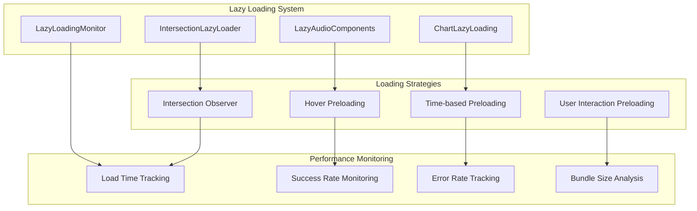

# Lazy Loading Strategy and Implementation Guide

## Overview

This document provides a comprehensive guide to the lazy loading strategy implemented in the BroLab Entertainment platform as part of the system optimization initiative. The lazy loading system is designed to optimize initial bundle size, improve page load performance, and provide a better user experience through intelligent component loading.

## Architecture Overview

### Core Components



### Implementation Strategy

The lazy loading system follows a three-tier approach:

1. **Critical Components**: Loaded immediately (above-the-fold content)
2. **Important Components**: Loaded with intersection observer (below-the-fold)
3. **Optional Components**: Loaded on user interaction or after delay

## Component Categories and Loading Strategies

### 1. Audio Components (High Priority)

**Components**: WaveformAudioPlayer, AudioAnalyzer, BeatPreview

**Strategy**: Intersection Observer with preloading

```typescript
// Audio components are critical for user experience
const LazyWaveformPlayer = createLazyLoader(
  () => import("@/components/audio/WaveformAudioPlayer"),
  {
    rootMargin: "100px", // Start loading 100px before visible
    preloadDelay: 1000, // Preload after 1 second
    priority: "high",
    onLoadStart: () => console.log("Loading audio player..."),
    onLoadComplete: () => console.log("Audio player ready"),
  }
);
```

**Rationale**: Audio components contain heavy libraries (WaveSurfer.js) but are essential for the music platform experience.

### 2. Chart and Analytics Components (Medium Priority)

**Components**: AnalyticsChart, SalesChart, ConversionFunnel

**Strategy**: Time-based preloading with hover enhancement

```typescript
// Charts are important but not immediately needed
const LazyAnalyticsChart = createChartLazyComponent(
  () => import("@/components/charts/AnalyticsChart"),
  {
    preloadOnHover: true,
    preloadDelay: 3000, // Load after 3 seconds
    priority: "medium",
  }
);
```

**Rationale**: Chart libraries are large but analytics are typically viewed after initial page interaction.

### 3. Modal and Form Components (Low Priority)

**Components**: CheckoutModal, ContactForm, ProfileEditor

**Strategy**: User interaction preloading

```typescript
// Modals loaded only when needed
const LazyCheckoutModal = createLazyLoader(() => import("@/components/modals/CheckoutModal"), {
  loadOnInteraction: true,
  preloadTriggers: ["mousedown", "touchstart"],
  priority: "low",
});
```

**Rationale**: Modals and forms are only needed when users perform specific actions.

## Loading Strategies Implementation

### 1. Intersection Observer Strategy

**Use Case**: Components that become visible as user scrolls

**Implementation**:

```typescript
const IntersectionLazyLoader = ({
  component,
  componentProps,
  rootMargin = '50px',
  threshold = 0.1
}) => {
  const [isVisible, setIsVisible] = useState(false);
  const [Component, setComponent] = useState(null);
  const ref = useRef(null);

  useEffect(() => {
    const observer = new IntersectionObserver(
      ([entry]) => {
        if (entry.isIntersecting) {
          setIsVisible(true);
          observer.disconnect();
        }
      },
      { rootMargin, threshold }
    );

    if (ref.current) {
      observer.observe(ref.current);
    }

    return () => observer.disconnect();
  }, [rootMargin, threshold]);

  useEffect(() => {
    if (isVisible && !Component) {
      component().then(module => {
        setComponent(() => module.default || module);
      });
    }
  }, [isVisible, Component, component]);

  return (
    <div ref={ref}>
      {Component ? (
        <Component {...componentProps} />
      ) : (
        <div style={{ minHeight: '200px' }}>Loading...</div>
      )}
    </div>
  );
};
```

**Configuration Options**:

- `rootMargin`: Distance before element becomes visible to start loading
- `threshold`: Percentage of element that must be visible
- `minHeight`: Placeholder height to prevent layout shift

### 2. Hover Preloading Strategy

**Use Case**: Components likely to be needed based on user hover behavior

**Implementation**:

```typescript
const usePreloadOnHover = importFn => {
  const [isPreloaded, setIsPreloaded] = useState(false);
  const ref = useRef(null);

  useEffect(() => {
    const element = ref.current;
    if (!element) return;

    const handleMouseEnter = () => {
      if (!isPreloaded) {
        importFn().then(() => setIsPreloaded(true));
      }
    };

    element.addEventListener("mouseenter", handleMouseEnter);
    return () => element.removeEventListener("mouseenter", handleMouseEnter);
  }, [importFn, isPreloaded]);

  return ref;
};
```

**Best Practices**:

- Use for components with high probability of interaction
- Implement debouncing to avoid excessive preloading
- Consider mobile users (no hover events)

### 3. Time-based Preloading Strategy

**Use Case**: Components that will likely be needed after initial page load

**Implementation**:

```typescript
const usePreloadAfterDelay = (importFunctions, delay = 2000) => {
  useEffect(() => {
    const timer = setTimeout(() => {
      importFunctions.forEach(importFn => {
        importFn().catch(error => {
          console.warn("Failed to preload component:", error);
        });
      });
    }, delay);

    return () => clearTimeout(timer);
  }, [importFunctions, delay]);
};
```

**Configuration Guidelines**:

- **2-3 seconds**: Important secondary features
- **5+ seconds**: Nice-to-have features
- **10+ seconds**: Rarely used features

### 4. User Interaction Preloading Strategy

**Use Case**: Components needed only after specific user actions

**Implementation**:

```typescript
const usePreloadOnInteraction = (importFunctions, events = ["mousedown", "touchstart"]) => {
  useEffect(() => {
    const preload = () => {
      importFunctions.forEach(importFn => {
        importFn().catch(error => {
          console.warn("Failed to preload on interaction:", error);
        });
      });

      // Remove listeners after first interaction
      events.forEach(event => {
        document.removeEventListener(event, preload);
      });
    };

    events.forEach(event => {
      document.addEventListener(event, preload, { once: true });
    });

    return () => {
      events.forEach(event => {
        document.removeEventListener(event, preload);
      });
    };
  }, [importFunctions, events]);
};
```

## Performance Monitoring and Optimization

### 1. Lazy Loading Metrics

**Key Performance Indicators**:

- Average load time per component
- Success rate (successful loads / total attempts)
- Error rate (failed loads / total attempts)
- Bundle size reduction
- Time to interactive improvement

**Monitoring Implementation**:

```typescript
class LazyLoadingMonitor {
  private metrics = new Map();

  trackComponentLoad(componentName: string, loadTime: number, success: boolean) {
    if (!this.metrics.has(componentName)) {
      this.metrics.set(componentName, {
        totalLoads: 0,
        successfulLoads: 0,
        totalLoadTime: 0,
        errors: [],
      });
    }

    const metric = this.metrics.get(componentName);
    metric.totalLoads++;
    metric.totalLoadTime += loadTime;

    if (success) {
      metric.successfulLoads++;
    } else {
      metric.errors.push({ timestamp: Date.now(), loadTime });
    }
  }

  getStats() {
    const stats = {};
    this.metrics.forEach((metric, componentName) => {
      stats[componentName] = {
        averageLoadTime: metric.totalLoadTime / metric.totalLoads,
        successRate: metric.successfulLoads / metric.totalLoads,
        errorRate: (metric.totalLoads - metric.successfulLoads) / metric.totalLoads,
        totalAttempts: metric.totalLoads,
      };
    });
    return stats;
  }
}
```

### 2. Performance Thresholds

**Warning Thresholds**:

- Average load time > 1000ms
- Success rate < 95%
- Error rate > 5%
- Bundle size increase > 10%

**Critical Thresholds**:

- Average load time > 2000ms
- Success rate < 90%
- Error rate > 10%
- Bundle size increase > 25%

### 3. Optimization Techniques

**Bundle Splitting Optimization**:

```typescript
// vite.config.ts
export default defineConfig({
  build: {
    rollupOptions: {
      output: {
        manualChunks: {
          // Vendor chunks
          "vendor-react": ["react", "react-dom"],
          "vendor-ui": ["@radix-ui/react-dialog", "@radix-ui/react-dropdown-menu"],

          // Feature chunks
          "audio-libs": ["wavesurfer.js"],
          "chart-libs": ["recharts", "d3"],

          // Component chunks
          "audio-components": [
            "client/src/components/audio/WaveformAudioPlayer",
            "client/src/components/audio/AudioAnalyzer",
          ],
          "chart-components": [
            "client/src/components/charts/AnalyticsChart",
            "client/src/components/charts/SalesChart",
          ],
        },
      },
    },
  },
});
```

**Preloading Optimization**:

```typescript
// Intelligent preloading based on user behavior
class IntelligentPreloader {
  private userBehavior = {
    visitedPages: [],
    interactionPatterns: [],
    deviceType: this.detectDeviceType(),
  };

  optimizePreloading() {
    // Adjust preloading strategy based on device
    if (this.userBehavior.deviceType === "mobile") {
      // Reduce preloading on mobile to save bandwidth
      return {
        preloadDelay: 5000,
        rootMargin: "50px",
        preloadOnHover: false,
      };
    }

    // Desktop optimization
    return {
      preloadDelay: 2000,
      rootMargin: "100px",
      preloadOnHover: true,
    };
  }
}
```

## Error Handling and Fallbacks

### 1. Loading Error Handling

**Error Types**:

- Network failures
- Import errors
- Component initialization errors
- Timeout errors

**Error Handling Strategy**:

```typescript
const LazyComponentWithErrorHandling = ({
  component,
  fallback,
  maxRetries = 3,
  retryDelay = 1000
}) => {
  const [error, setError] = useState(null);
  const [retryCount, setRetryCount] = useState(0);
  const [Component, setComponent] = useState(null);

  const loadComponent = async () => {
    try {
      const module = await component();
      setComponent(() => module.default || module);
      setError(null);
    } catch (err) {
      console.error('Failed to load component:', err);

      if (retryCount < maxRetries) {
        setTimeout(() => {
          setRetryCount(prev => prev + 1);
          loadComponent();
        }, retryDelay * Math.pow(2, retryCount)); // Exponential backoff
      } else {
        setError(err);
      }
    }
  };

  if (error && retryCount >= maxRetries) {
    return fallback || <div>Failed to load component</div>;
  }

  if (!Component) {
    return <div>Loading...</div>;
  }

  return <Component />;
};
```

### 2. Graceful Degradation

**Progressive Enhancement Strategy**:

```typescript
const ProgressivelyEnhancedComponent = ({ data }) => {
  const [enhancementsLoaded, setEnhancementsLoaded] = useState(false);

  useEffect(() => {
    // Load enhancements progressively
    const loadEnhancements = async () => {
      try {
        await Promise.all([
          import('@/components/enhancements/AdvancedFeatures'),
          import('@/components/enhancements/AnimationEffects'),
          import('@/components/enhancements/InteractiveElements')
        ]);
        setEnhancementsLoaded(true);
      } catch (error) {
        console.warn('Failed to load enhancements, using basic version:', error);
        // Continue with basic functionality
      }
    };

    // Load enhancements after initial render
    const timer = setTimeout(loadEnhancements, 1000);
    return () => clearTimeout(timer);
  }, []);

  return (
    <div>
      {/* Basic functionality - always available */}
      <BasicComponent data={data} />

      {/* Enhanced features - loaded progressively */}
      {enhancementsLoaded && (
        <Suspense fallback={<EnhancementsSkeleton />}>
          <EnhancedFeatures data={data} />
        </Suspense>
      )}
    </div>
  );
};
```

## Testing Strategy

### 1. Unit Testing Lazy Loading

```typescript
import { render, screen, waitFor } from '@testing-library/react';
import { vi } from 'vitest';

// Mock dynamic imports for testing
vi.mock('@/components/HeavyComponent', () => ({
  default: () => <div data-testid="heavy-component">Heavy Component Loaded</div>
}));

describe('Lazy Loading', () => {
  it('should load component when visible', async () => {
    // Mock IntersectionObserver
    const mockIntersectionObserver = vi.fn();
    mockIntersectionObserver.mockReturnValue({
      observe: () => null,
      unobserve: () => null,
      disconnect: () => null
    });
    window.IntersectionObserver = mockIntersectionObserver;

    render(<LazyHeavyComponent />);

    // Simulate intersection
    const [callback] = mockIntersectionObserver.mock.calls[0];
    callback([{ isIntersecting: true }]);

    await waitFor(() => {
      expect(screen.getByTestId('heavy-component')).toBeInTheDocument();
    });
  });
});
```

### 2. Performance Testing

```typescript
describe("Lazy Loading Performance", () => {
  it("should meet performance budgets", async () => {
    const startTime = performance.now();

    // Simulate component loading
    const LazyComponent = await import("@/components/TestComponent");

    const loadTime = performance.now() - startTime;

    expect(loadTime).toBeLessThan(1000); // Should load within 1 second
  });

  it("should track loading metrics", () => {
    const monitor = new LazyLoadingMonitor();

    // Simulate successful load
    monitor.trackComponentLoad("TestComponent", 500, true);

    const stats = monitor.getStats();
    expect(stats.TestComponent.successRate).toBe(1);
    expect(stats.TestComponent.averageLoadTime).toBe(500);
  });
});
```

## Deployment Considerations

### 1. Build Configuration

**Vite Configuration for Optimal Lazy Loading**:

```typescript
export default defineConfig({
  build: {
    rollupOptions: {
      output: {
        // Optimize chunk naming for caching
        chunkFileNames: "assets/[name]-[hash].js",

        // Manual chunks for better caching
        manualChunks: id => {
          if (id.includes("node_modules")) {
            if (id.includes("react")) return "vendor-react";
            if (id.includes("@radix-ui")) return "vendor-ui";
            if (id.includes("wavesurfer")) return "vendor-audio";
            return "vendor";
          }

          if (id.includes("components/audio")) return "audio-components";
          if (id.includes("components/charts")) return "chart-components";
          if (id.includes("components/modals")) return "modal-components";
        },
      },
    },

    // Optimize for lazy loading
    target: "es2020",
    minify: "terser",
    terserOptions: {
      compress: {
        drop_console: true,
        drop_debugger: true,
      },
    },
  },
});
```

### 2. CDN and Caching Strategy

**Cache Headers for Lazy Loaded Chunks**:

```nginx
# Nginx configuration for lazy loaded chunks
location ~* \.(js|css)$ {
    expires 1y;
    add_header Cache-Control "public, immutable";
    add_header Vary "Accept-Encoding";

    # Enable compression
    gzip on;
    gzip_vary on;
    gzip_types text/javascript application/javascript;
}

# Special handling for chunk files
location ~* /assets/.*-[a-f0-9]{8,}\.(js|css)$ {
    expires 1y;
    add_header Cache-Control "public, immutable";

    # Preload hints for critical chunks
    add_header Link "</assets/vendor-react.js>; rel=preload; as=script";
    add_header Link "</assets/vendor-ui.js>; rel=preload; as=script";
}
```

### 3. Monitoring in Production

**Production Monitoring Setup**:

```typescript
// Production lazy loading monitoring
if (process.env.NODE_ENV === "production") {
  const monitor = new LazyLoadingMonitor();

  // Track all lazy loading events
  window.addEventListener("lazyload:start", event => {
    monitor.trackLoadStart(event.detail.componentName);
  });

  window.addEventListener("lazyload:complete", event => {
    monitor.trackLoadComplete(
      event.detail.componentName,
      event.detail.loadTime,
      event.detail.success
    );
  });

  // Send metrics to analytics service
  setInterval(() => {
    const stats = monitor.getStats();
    analytics.track("lazy_loading_metrics", stats);
  }, 60000); // Every minute
}
```

## Best Practices Summary

### 1. Component Selection

- **Lazy load**: Below-the-fold components, heavy libraries, rarely used features
- **Don't lazy load**: Critical above-the-fold content, small components, essential UI elements

### 2. Loading Strategy Selection

- **Intersection Observer**: For components that become visible on scroll
- **Hover Preloading**: For components with high interaction probability
- **Time-based**: For secondary features that will likely be needed
- **User Interaction**: For modals, forms, and optional features

### 3. Performance Optimization

- Monitor loading metrics continuously
- Optimize bundle splitting for better caching
- Implement intelligent preloading based on user behavior
- Use appropriate fallbacks and error handling

### 4. Testing and Monitoring

- Test lazy loading behavior in different network conditions
- Monitor performance metrics in production
- Set up alerts for performance degradation
- Regularly review and optimize loading strategies

This comprehensive lazy loading strategy ensures optimal performance while maintaining excellent user experience across the BroLab Entertainment platform.
