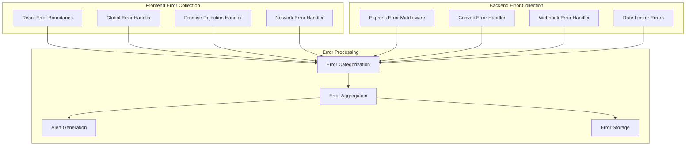

# Error Tracking and Monitoring Runbook

## Overview

This runbook provides comprehensive procedures for monitoring, tracking, and resolving errors in the BroLab Entertainment platform. The error tracking system provides real-time error detection, categorization, and resolution workflows.

## Error Tracking Architecture

### 1. Error Collection System



### 2. Error Categories

| Category     | Description                    | Severity | Response Time |
| ------------ | ------------------------------ | -------- | ------------- |
| **Critical** | System down, data loss         | P0       | < 15 minutes  |
| **High**     | Feature broken, security issue | P1       | < 1 hour      |
| **Medium**   | Performance degradation        | P2       | < 4 hours     |
| **Low**      | Minor UI issues, warnings      | P3       | < 24 hours    |

## Error Monitoring Procedures

### 1. Real-time Error Detection

```typescript
// Error detection system
class ErrorDetectionSystem {
  private errorThresholds = {
    critical: 1, // 1 critical error triggers alert
    high: 5, // 5 high errors in 5 minutes
    medium: 20, // 20 medium errors in 15 minutes
    low: 100, // 100 low errors in 1 hour
  };

  private timeWindows = {
    critical: 0, // Immediate
    high: 5 * 60 * 1000, // 5 minutes
    medium: 15 * 60 * 1000, // 15 minutes
    low: 60 * 60 * 1000, // 1 hour
  };

  detectAnomalies(errors: ErrorLog[]) {
    const now = Date.now();

    Object.entries(this.errorThresholds).forEach(([severity, threshold]) => {
      const window = this.timeWindows[severity as keyof typeof this.timeWindows];
      const recentErrors = errors.filter(
        error => error.level === severity && now - error.timestamp <= window
      );

      if (recentErrors.length >= threshold) {
        this.triggerAlert(severity, recentErrors);
      }
    });
  }

  private triggerAlert(severity: string, errors: ErrorLog[]) {
    const alert = {
      id: generateId(),
      severity,
      timestamp: Date.now(),
      errorCount: errors.length,
      affectedComponents: [...new Set(errors.map(e => e.component))],
      message: `${severity.toUpperCase()}: ${errors.length} errors detected`,
      errors: errors.slice(0, 5), // Include first 5 errors
    };

    this.sendAlert(alert);
  }
}
```

### 2. Error Categorization Rules

```typescript
// Error categorization system
class ErrorCategorizer {
  categorizeError(error: Error, context: ErrorContext): ErrorCategory {
    // Critical errors
    if (this.isCriticalError(error, context)) {
      return {
        severity: "critical",
        category: "system",
        priority: "P0",
        escalation: "immediate",
      };
    }

    // Security errors
    if (this.isSecurityError(error, context)) {
      return {
        severity: "high",
        category: "security",
        priority: "P1",
        escalation: "security-team",
      };
    }

    // Performance errors
    if (this.isPerformanceError(error, context)) {
      return {
        severity: "medium",
        category: "performance",
        priority: "P2",
        escalation: "performance-team",
      };
    }

    // Default categorization
    return {
      severity: "low",
      category: "general",
      priority: "P3",
      escalation: "development-team",
    };
  }

  private isCriticalError(error: Error, context: ErrorContext): boolean {
    const criticalPatterns = [
      /database.*connection.*failed/i,
      /payment.*processing.*failed/i,
      /authentication.*service.*down/i,
      /file.*system.*error/i,
      /memory.*out.*of.*bounds/i,
    ];

    return criticalPatterns.some(
      pattern => pattern.test(error.message) || pattern.test(error.stack || "")
    );
  }

  private isSecurityError(error: Error, context: ErrorContext): boolean {
    const securityPatterns = [
      /unauthorized.*access/i,
      /csrf.*token.*invalid/i,
      /rate.*limit.*exceeded/i,
      /webhook.*signature.*invalid/i,
      /sql.*injection.*attempt/i,
    ];

    return (
      securityPatterns.some(pattern => pattern.test(error.message)) ||
      context.component === "security"
    );
  }

  private isPerformanceError(error: Error, context: ErrorContext): boolean {
    return (
      context.metadata?.responseTime > 5000 ||
      context.metadata?.memoryUsage > 1000000000 ||
      error.message.includes("timeout")
    );
  }
}
```

## Alert Management

### 1. Alert Configuration

```typescript
// Alert configuration
const alertConfig = {
  channels: {
    critical: ["slack", "email", "sms", "pagerduty"],
    high: ["slack", "email"],
    medium: ["slack"],
    low: ["dashboard"],
  },

  recipients: {
    critical: ["on-call-engineer", "tech-lead", "cto"],
    high: ["development-team", "tech-lead"],
    medium: ["development-team"],
    low: ["assigned-developer"],
  },

  escalation: {
    critical: {
      initial: 0, // Immediate
      escalate: 15, // 15 minutes
      final: 30, // 30 minutes
    },
    high: {
      initial: 0,
      escalate: 60, // 1 hour
      final: 240, // 4 hours
    },
  },
};
```

### 2. Alert Handlers

```typescript
// Alert management system
class AlertManager {
  private activeAlerts = new Map<string, Alert>();
  private escalationTimers = new Map<string, NodeJS.Timeout>();

  async sendAlert(alert: Alert) {
    // Store active alert
    this.activeAlerts.set(alert.id, alert);

    // Send initial notifications
    await this.sendNotifications(alert, "initial");

    // Set up escalation timer
    if (alert.severity === "critical" || alert.severity === "high") {
      this.setupEscalation(alert);
    }

    // Log alert
    console.error(`🚨 ALERT [${alert.severity.toUpperCase()}]: ${alert.message}`);
  }

  private async sendNotifications(alert: Alert, stage: "initial" | "escalate" | "final") {
    const channels = alertConfig.channels[alert.severity];
    const recipients = alertConfig.recipients[alert.severity];

    for (const channel of channels) {
      try {
        await this.sendToChannel(channel, alert, recipients);
      } catch (error) {
        console.error(`Failed to send alert to ${channel}:`, error);
      }
    }
  }

  private async sendToChannel(channel: string, alert: Alert, recipients: string[]) {
    switch (channel) {
      case "slack":
        await this.sendSlackAlert(alert);
        break;
      case "email":
        await this.sendEmailAlert(alert, recipients);
        break;
      case "sms":
        await this.sendSMSAlert(alert, recipients);
        break;
      case "pagerduty":
        await this.sendPagerDutyAlert(alert);
        break;
    }
  }

  private setupEscalation(alert: Alert) {
    const escalationConfig = alertConfig.escalation[alert.severity];

    // Escalation timer
    const escalateTimer = setTimeout(
      () => {
        this.escalateAlert(alert, "escalate");
      },
      escalationConfig.escalate * 60 * 1000
    );

    // Final escalation timer
    const finalTimer = setTimeout(
      () => {
        this.escalateAlert(alert, "final");
      },
      escalationConfig.final * 60 * 1000
    );

    this.escalationTimers.set(alert.id, escalateTimer);
    this.escalationTimers.set(`${alert.id}-final`, finalTimer);
  }

  private async escalateAlert(alert: Alert, stage: "escalate" | "final") {
    console.warn(`⚠️ ESCALATING ALERT [${stage.toUpperCase()}]: ${alert.message}`);

    // Send escalation notifications
    await this.sendNotifications(alert, stage);

    // Update alert status
    alert.escalationStage = stage;
    alert.escalatedAt = Date.now();
  }

  resolveAlert(alertId: string, resolution: string) {
    const alert = this.activeAlerts.get(alertId);
    if (!alert) return;

    // Clear escalation timers
    const escalateTimer = this.escalationTimers.get(alertId);
    const finalTimer = this.escalationTimers.get(`${alertId}-final`);

    if (escalateTimer) clearTimeout(escalateTimer);
    if (finalTimer) clearTimeout(finalTimer);

    // Update alert
    alert.status = "resolved";
    alert.resolvedAt = Date.now();
    alert.resolution = resolution;

    // Remove from active alerts
    this.activeAlerts.delete(alertId);
    this.escalationTimers.delete(alertId);
    this.escalationTimers.delete(`${alertId}-final`);

    console.info(`✅ ALERT RESOLVED: ${alert.message} - ${resolution}`);
  }
}
```

## Error Resolution Procedures

### 1. Critical Error Response

```bash
#!/bin/bash
# critical-error-response.sh

echo "🚨 CRITICAL ERROR RESPONSE PROCEDURE"
echo "Timestamp: $(date)"

# 1. Immediate assessment
echo "1. Assessing system status..."
curl -f https://brolab.com/api/health || echo "❌ System health check failed"

# 2. Check error logs
echo "2. Checking recent error logs..."
tail -n 50 /var/log/brolab/error.log

# 3. Check system resources
echo "3. Checking system resources..."
df -h
free -h
ps aux --sort=-%cpu | head -10

# 4. Check database connectivity
echo "4. Checking database connectivity..."
curl -f https://brolab.com/api/health/db || echo "❌ Database connectivity failed"

# 5. Check external services
echo "5. Checking external services..."
curl -f https://api.clerk.dev/v1/health || echo "❌ Clerk service check failed"

# 6. Restart services if needed
echo "6. Service restart procedure..."
read -p "Restart services? (y/N): " restart
if [[ $restart == "y" || $restart == "Y" ]]; then
    pm2 restart all
    sudo systemctl restart nginx
    echo "✅ Services restarted"
fi

echo "✅ Critical error response completed"
```

### 2. Error Investigation Workflow

```typescript
// Error investigation system
class ErrorInvestigator {
  async investigateError(errorId: string): Promise<ErrorInvestigation> {
    const error = await this.getError(errorId);

    const investigation: ErrorInvestigation = {
      errorId,
      startedAt: Date.now(),
      steps: [],
      findings: [],
      recommendations: [],
    };

    // Step 1: Gather context
    investigation.steps.push("Gathering error context");
    const context = await this.gatherContext(error);
    investigation.findings.push(`Error occurred in ${context.component} during ${context.action}`);

    // Step 2: Check for similar errors
    investigation.steps.push("Checking for similar errors");
    const similarErrors = await this.findSimilarErrors(error);
    if (similarErrors.length > 0) {
      investigation.findings.push(
        `Found ${similarErrors.length} similar errors in the last 24 hours`
      );
    }

    // Step 3: Analyze error pattern
    investigation.steps.push("Analyzing error patterns");
    const pattern = await this.analyzeErrorPattern(error, similarErrors);
    investigation.findings.push(`Error pattern: ${pattern.type} - ${pattern.description}`);

    // Step 4: Check system health
    investigation.steps.push("Checking system health");
    const systemHealth = await this.checkSystemHealth();
    investigation.findings.push(`System health: ${systemHealth.status}`);

    // Step 5: Generate recommendations
    investigation.steps.push("Generating recommendations");
    investigation.recommendations = await this.generateRecommendations(
      error,
      pattern,
      systemHealth
    );

    investigation.completedAt = Date.now();
    return investigation;
  }

  private async gatherContext(error: ErrorLog): Promise<ErrorContext> {
    return {
      component: error.component,
      action: error.action,
      userId: error.userId,
      sessionId: error.sessionId,
      userAgent: error.metadata?.userAgent,
      url: error.metadata?.url,
      timestamp: error.timestamp,
    };
  }

  private async findSimilarErrors(error: ErrorLog): Promise<ErrorLog[]> {
    const timeWindow = 24 * 60 * 60 * 1000; // 24 hours
    const cutoff = Date.now() - timeWindow;

    return await this.errorStorage.query({
      message: { $regex: this.extractErrorPattern(error.message) },
      component: error.component,
      timestamp: { $gte: cutoff },
    });
  }

  private async analyzeErrorPattern(
    error: ErrorLog,
    similarErrors: ErrorLog[]
  ): Promise<ErrorPattern> {
    if (similarErrors.length === 0) {
      return { type: "isolated", description: "Single occurrence error" };
    }

    if (similarErrors.length > 10) {
      return { type: "recurring", description: "High frequency recurring error" };
    }

    const timeSpread =
      Math.max(...similarErrors.map(e => e.timestamp)) -
      Math.min(...similarErrors.map(e => e.timestamp));

    if (timeSpread < 60 * 60 * 1000) {
      // 1 hour
      return { type: "burst", description: "Error burst in short time period" };
    }

    return { type: "intermittent", description: "Intermittent recurring error" };
  }

  private async generateRecommendations(
    error: ErrorLog,
    pattern: ErrorPattern,
    systemHealth: SystemHealth
  ): Promise<string[]> {
    const recommendations: string[] = [];

    // Pattern-based recommendations
    switch (pattern.type) {
      case "recurring":
        recommendations.push("Investigate root cause - this error is occurring frequently");
        recommendations.push("Consider implementing circuit breaker pattern");
        break;
      case "burst":
        recommendations.push("Check for system overload or external service issues");
        recommendations.push("Review rate limiting configuration");
        break;
      case "isolated":
        recommendations.push("Monitor for recurrence - may be transient issue");
        break;
    }

    // System health-based recommendations
    if (systemHealth.memoryUsage > 0.8) {
      recommendations.push("High memory usage detected - investigate memory leaks");
    }

    if (systemHealth.cpuUsage > 0.8) {
      recommendations.push("High CPU usage detected - investigate performance bottlenecks");
    }

    // Error-specific recommendations
    if (error.message.includes("timeout")) {
      recommendations.push("Increase timeout values or optimize slow operations");
    }

    if (error.message.includes("rate limit")) {
      recommendations.push("Review rate limiting configuration or implement user education");
    }

    return recommendations;
  }
}
```

## Error Resolution Tracking

### 1. Resolution Workflow

```typescript
// Error resolution tracking
class ErrorResolutionTracker {
  async createResolutionTicket(error: ErrorLog): Promise<ResolutionTicket> {
    const ticket: ResolutionTicket = {
      id: generateId(),
      errorId: error.id,
      severity: error.level,
      status: "open",
      assignedTo: this.assignError(error),
      createdAt: Date.now(),
      title: `${error.component}: ${error.message.substring(0, 100)}`,
      description: this.generateDescription(error),
      steps: [],
      resolution: null,
    };

    await this.saveTicket(ticket);
    await this.notifyAssignee(ticket);

    return ticket;
  }

  async updateResolution(ticketId: string, update: ResolutionUpdate): Promise<void> {
    const ticket = await this.getTicket(ticketId);

    ticket.steps.push({
      timestamp: Date.now(),
      action: update.action,
      description: update.description,
      author: update.author,
    });

    if (update.status) {
      ticket.status = update.status;
    }

    if (update.assignedTo) {
      ticket.assignedTo = update.assignedTo;
      await this.notifyAssignee(ticket);
    }

    await this.saveTicket(ticket);
  }

  async resolveError(ticketId: string, resolution: ErrorResolution): Promise<void> {
    const ticket = await this.getTicket(ticketId);

    ticket.status = "resolved";
    ticket.resolvedAt = Date.now();
    ticket.resolution = resolution;

    // Update error log
    await this.updateErrorLog(ticket.errorId, {
      resolved: true,
      resolutionNotes: resolution.description,
      resolvedBy: resolution.resolvedBy,
    });

    // Close any active alerts
    await this.alertManager.resolveAlert(ticket.errorId, resolution.description);

    await this.saveTicket(ticket);
  }

  private assignError(error: ErrorLog): string {
    // Assignment logic based on error type and component
    const assignmentRules = {
      security: "security-team",
      payment: "payment-team",
      audio: "frontend-team",
      api: "backend-team",
      database: "infrastructure-team",
    };

    const component = error.component.toLowerCase();
    for (const [keyword, team] of Object.entries(assignmentRules)) {
      if (component.includes(keyword)) {
        return team;
      }
    }

    return "development-team"; // Default assignment
  }
}
```

### 2. Resolution Metrics

```typescript
// Resolution metrics tracking
class ResolutionMetrics {
  async generateMetricsReport(timeRange: TimeRange): Promise<ResolutionMetricsReport> {
    const tickets = await this.getTicketsInRange(timeRange);

    return {
      totalErrors: tickets.length,
      resolvedErrors: tickets.filter(t => t.status === "resolved").length,
      averageResolutionTime: this.calculateAverageResolutionTime(tickets),
      resolutionTimeByCategory: this.groupResolutionTimeByCategory(tickets),
      topErrorCategories: this.getTopErrorCategories(tickets),
      resolutionTrends: this.calculateResolutionTrends(tickets),
      teamPerformance: this.calculateTeamPerformance(tickets),
    };
  }

  private calculateAverageResolutionTime(tickets: ResolutionTicket[]): number {
    const resolvedTickets = tickets.filter(t => t.resolvedAt);
    if (resolvedTickets.length === 0) return 0;

    const totalTime = resolvedTickets.reduce((sum, ticket) => {
      return sum + (ticket.resolvedAt! - ticket.createdAt);
    }, 0);

    return totalTime / resolvedTickets.length;
  }

  private groupResolutionTimeByCategory(tickets: ResolutionTicket[]): Record<string, number> {
    const categories: Record<string, { total: number; count: number }> = {};

    tickets
      .filter(t => t.resolvedAt)
      .forEach(ticket => {
        const category = this.categorizeError(ticket);
        if (!categories[category]) {
          categories[category] = { total: 0, count: 0 };
        }

        categories[category].total += ticket.resolvedAt! - ticket.createdAt;
        categories[category].count += 1;
      });

    const result: Record<string, number> = {};
    Object.entries(categories).forEach(([category, data]) => {
      result[category] = data.total / data.count;
    });

    return result;
  }
}
```

## Monitoring Dashboard

### 1. Real-time Error Dashboard

```typescript
// Error dashboard data provider
class ErrorDashboard {
  async getDashboardData(): Promise<ErrorDashboardData> {
    const now = Date.now();
    const last24Hours = now - 24 * 60 * 60 * 1000;
    const last7Days = now - 7 * 24 * 60 * 60 * 1000;

    return {
      realTime: {
        activeAlerts: await this.getActiveAlerts(),
        errorRate: await this.getErrorRate(60 * 60 * 1000), // Last hour
        criticalErrors: await this.getCriticalErrors(last24Hours),
        systemHealth: await this.getSystemHealth(),
      },

      trends: {
        errorTrends: await this.getErrorTrends(last7Days),
        resolutionTrends: await this.getResolutionTrends(last7Days),
        categoryTrends: await this.getCategoryTrends(last7Days),
      },

      metrics: {
        totalErrors: await this.getTotalErrors(last24Hours),
        resolvedErrors: await this.getResolvedErrors(last24Hours),
        averageResolutionTime: await this.getAverageResolutionTime(last7Days),
        topErrorComponents: await this.getTopErrorComponents(last24Hours),
      },
    };
  }

  async getErrorRate(timeWindow: number): Promise<number> {
    const cutoff = Date.now() - timeWindow;
    const errors = await this.errorStorage.count({ timestamp: { $gte: cutoff } });
    return errors / (timeWindow / (60 * 1000)); // Errors per minute
  }

  async getErrorTrends(timeRange: number): Promise<ErrorTrend[]> {
    const bucketSize = timeRange / 24; // 24 data points
    const trends: ErrorTrend[] = [];

    for (let i = 0; i < 24; i++) {
      const start = Date.now() - timeRange + i * bucketSize;
      const end = start + bucketSize;

      const errorCount = await this.errorStorage.count({
        timestamp: { $gte: start, $lt: end },
      });

      trends.push({
        timestamp: start,
        errorCount,
        period: `${i}h ago`,
      });
    }

    return trends;
  }
}
```

### 2. Alert Status Dashboard

```html
<!-- Error monitoring dashboard -->
<div class="error-dashboard">
  <div class="dashboard-header">
    <h1>Error Monitoring Dashboard</h1>
    <div class="status-indicators">
      <div class="status-indicator critical">
        <span class="count">{{ criticalAlerts }}</span>
        <span class="label">Critical</span>
      </div>
      <div class="status-indicator high">
        <span class="count">{{ highAlerts }}</span>
        <span class="label">High</span>
      </div>
      <div class="status-indicator medium">
        <span class="count">{{ mediumAlerts }}</span>
        <span class="label">Medium</span>
      </div>
    </div>
  </div>

  <div class="dashboard-grid">
    <!-- Real-time metrics -->
    <div class="metric-card">
      <h3>Error Rate</h3>
      <div class="metric-value">{{ errorRate }}/min</div>
      <div class="metric-trend {{ errorTrend }}">{{ errorTrendPercentage }}%</div>
    </div>

    <!-- Active alerts -->
    <div class="alerts-panel">
      <h3>Active Alerts</h3>
      <div class="alert-list">
        <div v-for="alert in activeAlerts" class="alert-item" :class="alert.severity">
          <div class="alert-header">
            <span class="alert-severity">{{ alert.severity }}</span>
            <span class="alert-time">{{ formatTime(alert.timestamp) }}</span>
          </div>
          <div class="alert-message">{{ alert.message }}</div>
          <div class="alert-actions">
            <button @click="acknowledgeAlert(alert.id)">Acknowledge</button>
            <button @click="resolveAlert(alert.id)">Resolve</button>
          </div>
        </div>
      </div>
    </div>

    <!-- Error trends chart -->
    <div class="chart-panel">
      <h3>Error Trends (24h)</h3>
      <canvas id="errorTrendsChart"></canvas>
    </div>

    <!-- Top error categories -->
    <div class="categories-panel">
      <h3>Top Error Categories</h3>
      <div class="category-list">
        <div v-for="category in topCategories" class="category-item">
          <span class="category-name">{{ category.name }}</span>
          <span class="category-count">{{ category.count }}</span>
          <div class="category-bar">
            <div class="category-fill" :style="{ width: category.percentage + '%' }"></div>
          </div>
        </div>
      </div>
    </div>
  </div>
</div>
```

## Maintenance Procedures

### 1. Daily Error Review

```bash
#!/bin/bash
# daily-error-review.sh

echo "📊 Daily Error Review - $(date)"

# 1. Generate error summary
echo "1. Generating error summary..."
node scripts/generate-error-summary.js --period=24h

# 2. Check for new error patterns
echo "2. Checking for new error patterns..."
node scripts/analyze-error-patterns.js --period=24h

# 3. Review unresolved critical errors
echo "3. Reviewing unresolved critical errors..."
node scripts/list-unresolved-errors.js --severity=critical

# 4. Update error resolution metrics
echo "4. Updating resolution metrics..."
node scripts/update-resolution-metrics.js

# 5. Clean up old error logs
echo "5. Cleaning up old error logs..."
find /var/log/brolab -name "error-*.log" -mtime +30 -delete

echo "✅ Daily error review completed"
```

### 2. Weekly Error Analysis

```bash
#!/bin/bash
# weekly-error-analysis.sh

echo "📈 Weekly Error Analysis - $(date)"

# 1. Generate comprehensive error report
echo "1. Generating weekly error report..."
node scripts/generate-weekly-error-report.js

# 2. Analyze error trends
echo "2. Analyzing error trends..."
node scripts/analyze-error-trends.js --period=7d

# 3. Review team performance metrics
echo "3. Reviewing team performance..."
node scripts/team-performance-report.js --period=7d

# 4. Update error prevention strategies
echo "4. Updating prevention strategies..."
node scripts/update-prevention-strategies.js

# 5. Archive resolved errors
echo "5. Archiving resolved errors..."
node scripts/archive-resolved-errors.js --older-than=7d

echo "✅ Weekly error analysis completed"
```

This comprehensive error tracking runbook provides the foundation for maintaining high system reliability and quick error resolution in the BroLab Entertainment platform.
